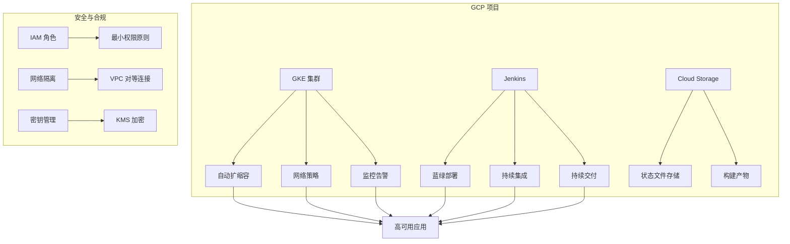

# HKC (HashiCorp Kubernetes Cloud)

基于 Terraform 的 GCP 云原生解决方案自动化部署框架

## 项目概述

HKC 是一个基于 Terraform 的自动化部署框架，专注于在 Google Cloud Platform (GCP) 上构建和管理云原生应用。本项目提供了一系列可重用的 Terraform 模块和部署方案，帮助开发者和运维团队快速搭建生产级的 Kubernetes 环境。

HKC 遵循基础设施即代码（IaC）的最佳实践，通过模块化设计实现了高度的可配置性和可扩展性。无论是小型创业公司还是大型企业，都可以基于 HKC 快速构建符合自身需求的云原生平台。

## 功能特性

### 核心功能

- **基础设施即代码**：使用 Terraform 定义和管理所有云资源
- **模块化设计**：可插拔的架构，便于扩展和定制
- **多环境支持**：支持开发、测试、生产等多环境部署
- **自动化部署**：集成 CI/CD 流水线，实现一键部署
- **最佳实践**：遵循云原生和 DevOps 最佳实践

### 技术优势

- **多云就绪**：虽然主要面向 GCP，但设计上支持多云部署
- **安全合规**：内置安全最佳实践，支持合规性要求
- **高性能**：优化配置确保应用高性能运行
- **可观测性**：集成监控、日志和追踪能力
- **成本优化**：自动扩缩容和资源优化，降低成本

## 系统要求

### 1. 先决条件

- [Terraform](https://www.terraform.io/downloads.html) >= 1.0.0
- [Google Cloud SDK](https://cloud.google.com/sdk/docs/install)
- [kubectl](https://kubernetes.io/docs/tasks/tools/)
- [Helm](https://helm.sh/docs/intro/install/) >= 3.0.0
- 有效的 GCP 项目和管理员权限
- 已启用必要的 GCP API

### 2. 资源需求

- **GCP 项目配额**：
  - 至少 8 个 vCPU
  - 至少 32GB 内存
  - 至少 200GB 持久存储
  - 足够的 IP 地址空间

### 3. 网络要求

- 出站互联网访问（用于下载容器镜像）
- 如果使用私有集群，需要配置 Cloud NAT 或代理服务器
- 确保 VPC 网络和子网配置正确

## 架构概览



## 详细功能说明

### 1. 网络配置

- **VPC 网络**：创建隔离的虚拟私有云网络
- **子网划分**：为不同环境配置独立的 IP 地址范围
- **防火墙规则**：精细控制入站和出站流量
- **NAT 网关**：为私有集群提供出站互联网访问

### 2. GKE 集群管理

- **集群配置**：支持区域和区域级集群部署
- **节点池管理**：配置工作节点规格和自动扩缩容
- **网络策略**：启用网络策略执行
- **工作负载身份**：安全的服务账户管理
- **私有集群**：增强安全性，限制公共访问

### 3. CI/CD 流水线

- **Jenkins 集成**：自动化构建和部署流程
- **蓝绿部署**：零停机部署和快速回滚
- **多环境管理**：支持开发、测试、生产环境独立部署
- **自动化测试**：集成单元测试和集成测试

## 子项目列表

### 1. tf-gcp-hpa

使用 Terraform 在 GCP 上实现 Kubernetes 的 Horizontal Pod Autoscaler (HPA) 功能

- 创建高可用的 GKE 集群
- 部署示例应用
- 配置 HPA 自动扩缩容
- 支持基于 CPU 和内存使用率的扩缩容
- 自定义指标支持
- 详细的监控和告警配置
- [查看架构图](./tf-gcp-hpa/README.md#架构图) | [English](./tf-gcp-hpa/README_EN.md)

### 2. tf-jenkins-bluegreen

在 Jenkins 上实现企业级的蓝绿部署方案

- 完整的 Jenkins 流水线
- 自动化的部署、测试、切换流程
- 支持一键回滚
- 基于 Nginx 的流量切换
- 多环境支持
- 详细的文档和示例
- [查看架构图](./tf-jenkins-bluegreen/README.md#架构图) | [English](./tf-jenkins-bluegreen/README_EN.md)

### 3. tf-jenkins-on-gke

在 GKE 上部署高可用的 Jenkins 实例

- 基于 StatefulSet 的 Jenkins 部署
- 持久化存储配置
- 自动扩缩容支持
- 备份和恢复机制
- 与 GCP 服务集成
- [查看详情](./tf-jenkins-on-gke/README.md) | [English](./tf-jenkins-on-gke/README_EN.md)

### 4. tf-hsbc-interview

HSBC 面试演示项目

- 完整的云原生 CI/CD 解决方案
- 蓝绿部署演示
- HPA 自动扩缩容演示
- 多环境支持
- [查看详情](./tf-hsbc-interview/README.md) | [English](./tf-hsbc-interview/README_EN.md)

### 5. tf-advanced-hsbc

增强版 HSBC 项目（基于 tf-hsbc-interview）

- 完整的云原生 CI/CD 解决方案
- 远程状态管理（GCS 后端）
- 多环境脚本化部署（开发/预发/生产）
- 高级安全与合规配置
- 自动化测试与验证
- 详细的监控与告警
- [查看详情](./tf-advanced-hsbc/README.md) | [English](./tf-advanced-hsbc/README_EN.md)

## 部署指南

### 1. 环境准备

```bash
# 安装必要工具
brew install terraform kubectl helm google-cloud-sdk

# 配置 gcloud 认证
gcloud auth login
gcloud config set project YOUR_PROJECT_ID

# 启用必要的 API
gcloud services enable \
    container.googleapis.com \
    compute.googleapis.com \
    cloudresourcemanager.googleapis.com \
    iam.googleapis.com
```

### 2. 项目配置

1. 克隆仓库：
```bash
git clone https://github.com/your-org/hkc.git
cd hkc
```

2. 选择并进入子项目目录：
```bash
cd tf-gcp-hpa  # 或其他子项目
```

3. 配置变量：
```bash
cp terraform.tfvars.example terraform.tfvars
# 编辑 terraform.tfvars 文件，填入您的配置
```

### 3. 部署基础设施

```bash
# 初始化 Terraform
terraform init

# 查看执行计划
terraform plan

# 应用配置
terraform apply

# 等待部署完成（约 10-15 分钟）
```

### 4. 验证部署

```bash
# 获取集群凭据
gcloud container clusters get-credentials $(terraform output -raw kubernetes_cluster_name) \
    --region $(terraform output -raw region)

# 验证节点状态
kubectl get nodes

# 验证 Pod 状态
kubectl get pods --all-namespaces
```

## 监控与告警

### 1. 访问监控仪表板

```bash
# 端口转发到本地
kubectl port-forward -n monitoring svc/prometheus-server 9090:80 &
kubectl port-forward -n monitoring svc/grafana 3000:80 &

# 访问地址
# Prometheus: http://localhost:9090
# Grafana: http://localhost:3000 (admin/prom-operator)
```

### 2. 配置告警规则

1. 在 Prometheus 中配置告警规则
2. 设置 Alertmanager 接收告警
3. 配置通知渠道（Email、Slack、PagerDuty 等）

### 3. 查看日志

```bash
# 查看系统组件日志
kubectl logs -f -n kube-system

# 查看应用日志
kubectl logs -f <pod-name> -n <namespace>

# 查看 GCP 日志
gcloud logging read 'resource.type="k8s_container"' --limit=50 --format="table(timestamp,resource.labels.container_name,textPayload)"

## 安全加固

### 1. 网络策略

默认启用的网络策略限制 Pod 间通信：

```yaml
apiVersion: networking.k8s.io/v1
kind: NetworkPolicy
metadata:
  name: default-deny-all
  namespace: default
spec:
  podSelector: {}
  policyTypes:
  - Ingress
  - Egress
```

### 2. 密钥管理

使用 Kubernetes Secrets 或外部密钥管理系统：

```bash
# 创建加密密钥
kubectl create secret generic app-secrets \
  --from-literal=db-password='your-secure-password' \
  --namespace=your-namespace
```

### 3. 安全上下文

为 Pod 和容器配置安全上下文：

```yaml
securityContext:
  runAsNonRoot: true
  runAsUser: 1000
  fsGroup: 2000
  allowPrivilegeEscalation: false
  capabilities:
    drop: ["ALL"]
```

## 维护与排错

### 1. 常见问题

#### 1.1 部署失败

```bash
# 查看部署状态
kubectl get pods --all-namespaces

# 查看事件
kubectl get events --sort-by='.metadata.creationTimestamp'

# 描述有问题的 Pod
kubectl describe pod <pod-name> -n <namespace>
```

#### 1.2 网络问题

```bash
# 检查服务状态
kubectl get svc --all-namespaces

# 检查入口控制器
kubectl get ingress --all-namespaces

# 检查网络策略
kubectl get networkpolicies --all-namespaces
```

### 2. 性能调优

#### 2.1 调整资源限制

```hcl
# 在 terraform.tfvars 中调整资源限制
jenkins_resources = {
  master = {
    limits = {
      cpu    = "4000m"
      memory = "8192Mi"
    }
  }
}
```

#### 2.2 优化 JVM 参数

```hcl
jenkins_java_opts = "-Xms2048m -Xmx4096m -XX:MaxMetaspaceSize=512m -XX:MaxRAMFraction=2 -XX:+UseContainerSupport -XX:+UseG1GC"
```

## 最佳实践

### 1. 生产环境建议

- 使用专用节点池运行关键工作负载
- 为生产环境启用私有集群
- 配置定期备份
- 实施细粒度的访问控制
- 定期更新容器镜像和依赖项

### 2. 安全建议

- 限制对 Kubernetes API 的访问
- 使用工作负载身份进行服务认证
- 定期轮换凭据和密钥
- 审计集群活动
- 启用网络策略和 Pod 安全策略

### 3. 成本优化

- 使用抢占式实例降低成本
- 配置集群自动扩缩容
- 设置预算提醒
- 定期清理未使用的资源

## 贡献指南

我们欢迎并感谢您的贡献！在提交 Pull Request 前，请确保：

1. 您的代码遵循项目代码风格
2. 包含必要的测试用例
3. 更新相关文档
4. 提交信息清晰明确
2. 包含适当的测试用例
3. 更新相关文档
4. 提交信息清晰明确

### 开发流程

1. Fork 本仓库
2. 创建特性分支 (`git checkout -b feature/AmazingFeature`)
3. 提交更改 (`git commit -m 'Add some AmazingFeature'`)
4. 推送到分支 (`git push origin feature/AmazingFeature`)
5. 提交 Pull Request

## 许可证

本项目采用 [Apache 2.0 许可证](LICENSE)

## 致谢

- [Terraform](https://www.terraform.io/)
- [Google Cloud](https://cloud.google.com/)
- [Kubernetes](https://kubernetes.io/)
- [Jenkins](https://www.jenkins.io/)

## 联系我们

如有问题或建议，请通过以下方式联系我们：

- 提交 [Issue](https://github.com/your-org/hkc/issues)
- 发送邮件至：support@example.com
- 加入我们的 [Slack 频道](#)

## 版本历史

### v1.0.0 (2023-11-01)

- 初始版本发布
- 支持 GKE 集群自动化部署
- 集成 Jenkins 和 HPA 功能

## 支持与帮助

如果您遇到问题或需要帮助，请：

1. 查看 [FAQ](#faq) 部分
2. 在 GitHub 上提交 [Issue](https://github.com/your-org/hkc/issues)
3. 加入我们的 [Slack 频道](#) 获取实时支持

## FAQ

### 如何升级 Terraform 版本？

请参考 [Terraform 官方升级指南](https://www.terraform.io/upgrade-guides/)。

### 如何备份 Terraform 状态？

建议启用 GCS 后端来存储状态文件，示例配置：

```hcl
terraform {
  backend "gcs" {
    bucket = "your-tfstate-bucket"
    prefix = "terraform/state"
  }
}
```

## 路线图

- [ ] 多区域部署支持
- [ ] 自动灾难恢复
- [ ] 成本优化建议
- [ ] 安全合规检查

## 致谢

- [Terraform](https://www.terraform.io/)
- [Google Cloud](https://cloud.google.com/)
- [Kubernetes](https://kubernetes.io/)
