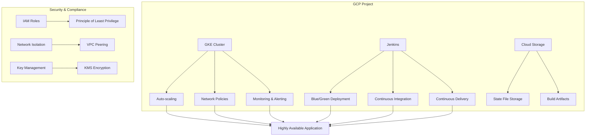

# HKC (HashiCorp Kubernetes Cloud)

Terraform-based Automated Deployment Framework for GCP Cloud-Native Solutions

## Project Overview

HKC is a Terraform-based automation framework designed for building and managing cloud-native applications on Google Cloud Platform (GCP). This project provides a comprehensive collection of reusable Terraform modules and deployment solutions to help developers and operations teams quickly set up production-grade Kubernetes environments.

HKC adheres to Infrastructure as Code (IaC) best practices, featuring a modular design that ensures high configurability and scalability. Whether you're a startup or an enterprise, HKC enables you to rapidly build a cloud-native platform tailored to your specific requirements.

## Key Features

### Core Features

- **Infrastructure as Code**: Define and manage all cloud resources using Terraform
- **Modular Design**: Pluggable architecture for easy extension and customization
- **Multi-Environment Support**: Deploy to development, staging, and production environments
- **Automated Deployment**: Integrated CI/CD pipeline for one-click deployment
- **Best Practices**: Follows cloud-native and DevOps best practices

### Technical Advantages

- **Multi-Cloud Ready**: Primarily targets GCP but designed with multi-cloud compatibility
- **Security & Compliance**: Built-in security best practices and compliance support
- **High Performance**: Optimized configurations for optimal application performance
- **Observability**: Integrated monitoring, logging, and tracing capabilities
- **Cost Optimization**: Auto-scaling and resource optimization to reduce costs

## System Requirements

### 1. Prerequisites

- [Terraform](https://www.terraform.io/downloads.html) >= 1.0.0
- [Google Cloud SDK](https://cloud.google.com/sdk/docs/install)
- [kubectl](https://kubernetes.io/docs/tasks/tools/)
- [Helm](https://helm.sh/docs/intro/install/) >= 3.0.0
- Valid GCP project with admin privileges
- Required GCP APIs enabled

### 2. Resource Requirements

- **GCP Project Quota**:
  - Minimum 8 vCPUs
  - Minimum 32GB RAM
  - Minimum 200GB persistent storage
  - Sufficient IP address space

### 3. Network Requirements

- Outbound internet access (for container image downloads)
- Cloud NAT or proxy server configuration for private clusters
- Properly configured VPC networks and subnets

## Architecture Overview



## Detailed Features

### 1. Network Configuration

- **VPC Networking**: Create isolated virtual private cloud networks
- **Subnet Management**: Dedicated IP ranges for different environments
- **Firewall Rules**: Granular control over inbound and outbound traffic
- **NAT Gateway**: Outbound internet access for private clusters

### 2. GKE Cluster Management

- **Cluster Configuration**: Support for zonal and regional cluster deployments
- **Node Pool Management**: Configure worker node specs and auto-scaling
- **Network Policies**: Enable network policy enforcement
- **Workload Identity**: Secure service account management
- **Private Clusters**: Enhanced security with restricted public access

### 3. CI/CD Pipeline

- **Jenkins Integration**: Automated build and deployment workflows
- **Blue/Green Deployment**: Zero-downtime deployments and rollback
- **Multi-Environment Management**: Independent deployments for dev, staging, and prod
- **Automated Testing**: Integrated unit and integration testing

## Subprojects

### 1. tf-gcp-hpa

Implement Kubernetes Horizontal Pod Autoscaler (HPA) on GCP using Terraform

- Create highly available GKE clusters
- Deploy sample applications
- Configure HPA for auto-scaling
- Support for CPU and memory-based scaling
- Custom metrics support
- Comprehensive monitoring and alerting
- [View Architecture](./tf-gcp-hpa/README_EN.md#architecture) | [中文](./tf-gcp-hpa/README.md)

### 2. tf-jenkins-bluegreen

Enterprise-grade blue/green deployment solution with Jenkins

- Complete Jenkins pipeline
- Automated deployment, testing, and switching
- One-click rollback support
- Nginx-based traffic switching
- Multi-environment support
- Detailed documentation and examples
- [View Architecture](./tf-jenkins-bluegreen/README_EN.md#architecture) | [中文](./tf-jenkins-bluegreen/README.md)

### 3. tf-jenkins-on-gke

Deploy highly available Jenkins on GKE

- StatefulSet-based Jenkins deployment
- Persistent storage configuration
- Auto-scaling support
- Backup and recovery mechanisms
- Integration with GCP services
- [View Details](./tf-jenkins-on-gke/README_EN.md) | [中文](./tf-jenkins-on-gke/README.md)

### 4. tf-hsbc-interview

HSBC Interview Demo Project

- Complete cloud-native CI/CD solution
- Blue/Green deployment demo
- HPA auto-scaling demo
- Multi-environment support
- [View Details](./tf-hsbc-interview/README_EN.md) | [中文](./tf-hsbc-interview/README.md)

## Subprojects

### 1. tf-gcp-hpa

Implementing Kubernetes Horizontal Pod Autoscaler (HPA) on GCP using Terraform

- Create highly available GKE clusters
- Deploy sample applications
- Configure HPA for automatic scaling
- Support scaling based on CPU and memory utilization
- Custom metrics support
- [View Architecture Diagram](./tf-gcp-hpa/README_EN.md#architecture-diagram)

### 2. tf-jenkins-bluegreen

Enterprise-grade Blue/Green Deployment implementation on Jenkins

- Complete Jenkins pipeline
- Automated deployment, testing, and switching process
- One-click rollback support
- Nginx-based traffic switching
- Multi-environment support
- [View Architecture Diagram](./tf-jenkins-bluegreen/README_EN.md#architecture-diagram)

## Deployment Guide

### 1. Environment Setup

```bash
# Install required tools
brew install terraform kubectl helm google-cloud-sdk

# Configure gcloud authentication
gcloud auth login
gcloud config set project YOUR_PROJECT_ID

# Enable required APIs
gcloud services enable \
    container.googleapis.com \
    compute.googleapis.com \
    cloudresourcemanager.googleapis.com \
    iam.googleapis.com
```

### 2. Project Configuration

1. Clone the repository:
```bash
git clone https://github.com/your-org/hkc.git
cd hkc
```

2. Navigate to the desired subproject:
```bash
cd tf-gcp-hpa  # or other subproject
```

3. Configure variables:
```bash
cp terraform.tfvars.example terraform.tfvars
# Edit terraform.tfvars with your configuration
```

### 3. Deploy Infrastructure

```bash
# Initialize Terraform
terraform init

# Review execution plan
terraform plan

# Apply configuration
terraform apply

# Wait for deployment to complete (approximately 10-15 minutes)
```

### 4. Verify Deployment

```bash
# Get cluster credentials
gcloud container clusters get-credentials $(terraform output -raw kubernetes_cluster_name) \
    --region $(terraform output -raw region)

# Check node status
kubectl get nodes

# Check pod status
kubectl get pods --all-namespaces
```

## Monitoring & Alerting

### 1. Access Dashboards

```bash
# Port forward to localhost
kubectl port-forward -n monitoring svc/prometheus-server 9090:80 &
kubectl port-forward -n monitoring svc/grafana 3000:80 &

# Access URLs
# Prometheus: http://localhost:9090
# Grafana: http://localhost:3000 (admin/prom-operator)
```

### 2. Configure Alerting

1. Set up alert rules in Prometheus
2. Configure Alertmanager to receive alerts
3. Set up notification channels (Email, Slack, PagerDuty, etc.)

### 3. View Logs

```bash
# View system component logs
kubectl logs -f -n kube-system

# View application logs
kubectl logs -f <pod-name> -n <namespace>

# View GCP logs
gcloud logging read 'resource.type="k8s_container"' --limit=50 --format="table(timestamp,resource.labels.container_name,textPayload)"
terraform apply
```

## Security Hardening

### 1. Network Policies

Default network policies restrict pod-to-pod communication:

```yaml
apiVersion: networking.k8s.io/v1
kind: NetworkPolicy
metadata:
  name: default-deny-all
  namespace: default
spec:
  podSelector: {}
  policyTypes:
  - Ingress
  - Egress
```

### 2. Secret Management

Use Kubernetes Secrets or external secret management systems:

```bash
# Create an encrypted secret
kubectl create secret generic app-secrets \
  --from-literal=db-password='your-secure-password' \
  --namespace=your-namespace
```

### 3. Security Context

Configure security context for pods and containers:

```yaml
securityContext:
  runAsNonRoot: true
  runAsUser: 1000
  fsGroup: 2000
  allowPrivilegeEscalation: false
  capabilities:
    drop: ["ALL"]
```

## Maintenance & Troubleshooting

### 1. Common Issues

#### 1.1 Deployment Failures

```bash
# Check deployment status
kubectl get pods --all-namespaces

# View events
kubectl get events --sort-by='.metadata.creationTimestamp'

# Describe problematic pod
kubectl describe pod <pod-name> -n <namespace>
```

#### 1.2 Network Issues

```bash
# Check service status
kubectl get svc --all-namespaces

# Check ingress controllers
kubectl get ingress --all-namespaces

# Check network policies
kubectl get networkpolicies --all-namespaces
```

### 2. Performance Tuning

#### 2.1 Adjust Resource Limits

```hcl
# Adjust resource limits in terraform.tfvars
jenkins_resources = {
  master = {
    limits = {
      cpu    = "4000m"
      memory = "8192Mi"
    }
  }
}
```

#### 2.2 Optimize JVM Parameters

```hcl
jenkins_java_opts = "-Xms2048m -Xmx4096m -XX:MaxMetaspaceSize=512m -XX:MaxRAMFraction=2 -XX:+UseContainerSupport -XX:+UseG1GC"
```

## Best Practices

### 1. Production Recommendations

- Use dedicated node pools for critical workloads
- Enable private clusters for production
- Configure regular backups
- Implement fine-grained access controls
- Regularly update container images and dependencies

### 2. Security Recommendations

- Restrict access to Kubernetes API
- Use Workload Identity for service authentication
- Rotate credentials and keys regularly
- Audit cluster activities
- Enable network policies and pod security policies

### 3. Cost Optimization

- Use preemptible instances to reduce costs
- Configure cluster auto-scaling
- Set up budget alerts
- Clean up unused resources regularly

## Contributing

We welcome and appreciate contributions! Before submitting a Pull Request, please ensure:

1. Your code follows the project's coding style
2. Include necessary test cases
3. Update relevant documentation
4. Provide clear commit messages

### Development Workflow

1. Fork the repository
2. Create a feature branch (`git checkout -b feature/AmazingFeature`)
3. Commit your changes (`git commit -m 'Add some AmazingFeature'`)
4. Push to the branch (`git push origin feature/AmazingFeature`)
5. Open a Pull Request

## License

This project is licensed under the [Apache 2.0 License](LICENSE)

## Acknowledgments

- [Terraform](https://www.terraform.io/)
- [Google Cloud](https://cloud.google.com/)
- [Kubernetes](https://kubernetes.io/)
- [Jenkins](https://www.jenkins.io/)

## Contact Us

For questions or suggestions, please contact us through:

- Open an [Issue](https://github.com/your-org/hkc/issues)
- Email: support@example.com
- Join our [Slack Channel](#)

## Version History

### v1.0.0 (2023-11-01)

- Initial release
- Support for GKE cluster automation
- Integrated Jenkins and HPA functionality

## Support & Help

If you encounter any issues or need assistance:

1. Check the [FAQ](#faq) section
2. Open an [Issue](https://github.com/your-org/hkc/issues)
3. Join our [Slack Channel](#) for real-time support

## FAQ

### How to upgrade Terraform version?

Please refer to the [Terraform Upgrade Guide](https://www.terraform.io/upgrade-guides/).

### How to back up Terraform state?

It's recommended to use GCS backend for state storage. Example configuration:

```hcl
terraform {
  backend "gcs" {
    bucket = "your-tfstate-bucket"
    prefix = "terraform/state"
  }
}
```

## Roadmap

- [ ] Multi-region deployment support
- [ ] Automated disaster recovery
- [ ] Cost optimization recommendations
- [ ] Security compliance checks
