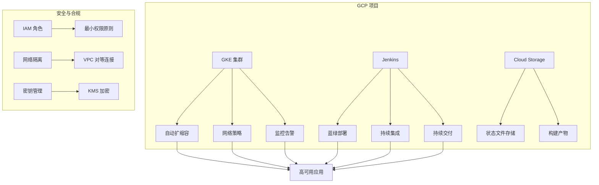

# 高级 HSBC 演示项目

基于 Terraform 的 GCP 云原生解决方案自动化部署框架，提供高级功能和最佳实践。

## 项目概述

`tf-advanced-hsbc` 是基于 `tf-hsbc-interview` 的增强版本，添加了以下高级功能：

- **远程状态管理**：使用 GCS 存储 Terraform 状态文件
- **多环境支持**：开发、预发布和生产环境的独立配置
- **脚本化部署**：自动化部署和销毁流程
- **模块化设计**：可重用的 Terraform 模块
- **安全最佳实践**：遵循安全最佳实践的基础设施即代码

## 功能特性

### 核心功能

- **GKE 集群管理**：自动创建和配置 GKE 集群
- **蓝绿部署**：零停机时间部署策略
- **自动扩缩容**：基于 CPU 和内存使用情况自动扩缩容
- **网络隔离**：安全的网络策略和防火墙规则
- **监控告警**：集成的监控和告警系统

### 高级功能

- **多环境管理**：独立的环境配置和状态
- **远程状态锁**：防止状态文件冲突
- **自动化部署**：一键式部署和销毁
- **安全加固**：遵循安全最佳实践
- **成本优化**：资源使用和成本监控

## 快速开始

### 先决条件

- [Terraform](https://www.terraform.io/downloads.html) >= 1.0.0
- [Google Cloud SDK](https://cloud.google.com/sdk/docs/install)
- [kubectl](https://kubernetes.io/docs/tasks/tools/)
- 具有适当权限的 GCP 项目

### 初始化环境

1. 克隆仓库：
   ```bash
   git clone https://github.com/PatHoo/HKC.git
   cd HKC/tf-advanced-hsbc
   ```

2. 初始化后端存储（GCS 存储桶）：
   ```powershell
   .\scripts\init-backend.ps1 -Environment dev -ProjectId YOUR_PROJECT_ID
   ```

3. 配置环境变量：
   - 编辑 `environments/<env>/terraform.tfvars` 文件
   - 根据需求修改配置参数

### 部署基础设施

```powershell
# 创建执行计划
.\scripts\deploy.ps1 -Environment dev -Action plan

# 应用配置（需要确认）
.\scripts\deploy.ps1 -Environment dev -Action apply

# 自动应用配置（无需确认）
.\scripts\deploy.ps1 -Environment dev -Action apply -AutoApprove
```

### 销毁基础设施

```powershell
# 销毁开发环境
.\scripts\deploy.ps1 -Environment dev -Action destroy -AutoApprove
```

## 项目结构

```
tf-advanced-hsbc/
├── environments/           # 环境配置
│   ├── dev/               # 开发环境
│   ├── stage/             # 预发布环境
│   ├── prod/              # 生产环境
│   └── _templates/        # 模板文件
├── modules/               # 可重用模块
│   ├── gke/               # GKE 集群模块
│   ├── network/           # 网络模块
│   ├── hpa-demo/          # HPA 演示应用
│   ├── jenkins/           # Jenkins 配置
│   └── state/             # 状态管理
├── scripts/               # 部署脚本
│   ├── deploy.ps1         # 部署脚本
│   └── init-backend.ps1   # 初始化脚本
└── docs/                  # 文档
```

## 架构图



## 贡献指南

我们欢迎并感谢您的贡献！在提交 Pull Request 之前，请确保：

1. 您的代码遵循项目的代码风格
2. 包含必要的测试用例
3. 更新相关文档
4. 提供清晰的提交信息

## 许可证

本项目采用 [Apache 2.0 许可证](LICENSE)

## 联系方式

如有问题或建议，请通过以下方式联系我们：

- 提交 [Issue](https://github.com/PatHoo/HKC/issues)
- 发送邮件至：support@example.com
- 加入我们的 [Slack 频道](#)

## 版本历史

### v1.0.0 (2023-07-08)

- 初始版本发布
- 支持 GKE 集群自动化
- 集成 Jenkins 和 HPA 功能
- 添加多环境支持
- 实现远程状态管理
