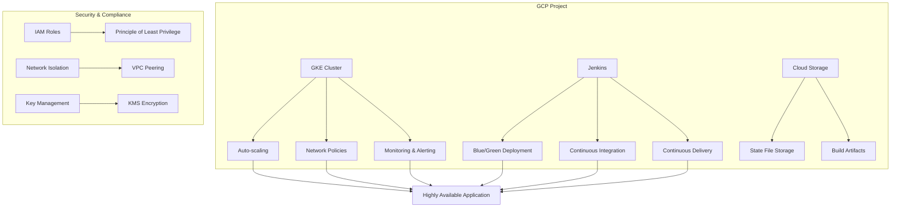

# Advanced HSBC Demo Project

A Terraform-based automated deployment framework for GCP cloud-native solutions with advanced features.

## Project Overview

`tf-advanced-hsbc` is an enhanced version of `tf-hsbc-interview` with the following advanced features:

- **Remote State Management**: Using GCS for Terraform state storage
- **Multi-Environment Support**: Separate configurations for dev, stage, and prod environments
- **Scripted Deployment**: Automated deployment and teardown processes
- **Modular Design**: Reusable Terraform modules
- **Security Best Practices**: Infrastructure as Code following security best practices

## Features

### Core Features

- **GKE Cluster Management**: Automated GKE cluster creation and configuration
- **Blue/Green Deployment**: Zero-downtime deployment strategy
- **Auto-scaling**: Automatic scaling based on CPU and memory usage
- **Network Isolation**: Secure network policies and firewall rules
- **Monitoring & Alerting**: Integrated monitoring and alerting system

### Advanced Features

- **Multi-Environment Management**: Isolated environment configurations and states
- **Remote State Locking**: Prevent state file conflicts
- **Automated Deployment**: One-click deployment and teardown
- **Security Hardening**: Follow security best practices
- **Cost Optimization**: Resource usage and cost monitoring

## Quick Start

### Prerequisites

- [Terraform](https://www.terraform.io/downloads.html) >= 1.0.0
- [Google Cloud SDK](https://cloud.google.com/sdk/docs/install)
- [kubectl](https://kubernetes.io/docs/tasks/tools/)
- GCP project with appropriate permissions

### Initialize Environment

1. Clone the repository:
   ```bash
   git clone https://github.com/PatHoo/HKC.git
   cd HKC/tf-advanced-hsbc
   ```

2. Initialize the backend (GCS bucket):
   ```powershell
   .\scripts\init-backend.ps1 -Environment dev -ProjectId YOUR_PROJECT_ID
   ```

3. Configure environment variables:
   - Edit `environments/<env>/terraform.tfvars`
   - Modify configuration parameters as needed

### Deploy Infrastructure

```powershell
# Create an execution plan
.\scripts\deploy.ps1 -Environment dev -Action plan

# Apply configuration (with confirmation)
.\scripts\deploy.ps1 -Environment dev -Action apply

# Auto-apply configuration (no confirmation)
.\scripts\deploy.ps1 -Environment dev -Action apply -AutoApprove
```

### Destroy Infrastructure

```powershell
# Destroy dev environment
.\scripts\deploy.ps1 -Environment dev -Action destroy -AutoApprove
```

## Project Structure

```
tf-advanced-hsbc/
├── environments/           # Environment configurations
│   ├── dev/               # Development environment
│   ├── stage/             # Staging environment
│   ├── prod/              # Production environment
│   └── _templates/        # Template files
├── modules/               # Reusable modules
│   ├── gke/               # GKE cluster module
│   ├── network/           # Network module
│   ├── hpa-demo/          # HPA demo application
│   ├── jenkins/           # Jenkins configuration
│   └── state/             # State management
├── scripts/               # Deployment scripts
│   ├── deploy.ps1         # Deployment script
│   └── init-backend.ps1   # Initialization script
└── docs/                  # Documentation
```

## Architecture Diagram



## Contributing

We welcome and appreciate your contributions! Before submitting a Pull Request, please ensure:

1. Your code follows the project's coding style
2. Include necessary test cases
3. Update relevant documentation
4. Provide clear commit messages

## License

This project is licensed under the [Apache 2.0 License](LICENSE)

## Contact Us

For questions or suggestions, please contact us through:

- Open an [Issue](https://github.com/PatHoo/HKC/issues)
- Email: support@example.com
- Join our [Slack Channel](#)

## Version History

### v1.0.0 (2023-07-08)

- Initial release
- GKE cluster automation
- Integrated Jenkins and HPA functionality
- Added multi-environment support
- Implemented remote state management
