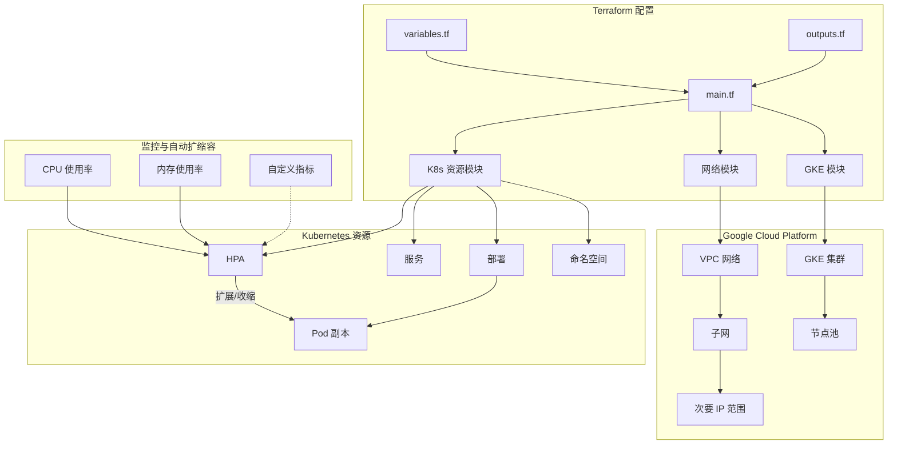

# GCP Terraform HPA 实现

本项目使用 Terraform 在 Google Cloud Platform (GCP) 上实现 Kubernetes 的 Horizontal Pod Autoscaler (HPA) 功能，提供完整的自动化部署方案。通过本方案，您可以快速搭建支持自动扩缩容的 GKE 集群，并部署配置了 HPA 的应用程序。

## 架构图

详细的架构图可在 [docs/architecture.md](docs/architecture.md) 中查看。



## 项目结构

```
tf-gcp-hpa/
├── main.tf                 # 主 Terraform 配置文件
├── variables.tf            # 变量定义
├── terraform.tfvars.example # 变量值示例
├── modules/
│   ├── gke/                # GKE 集群模块
│   │   ├── main.tf
│   │   ├── variables.tf
│   │   └── outputs.tf
│   ├── network/            # 网络模块
│   │   ├── main.tf
│   │   ├── variables.tf
│   │   └── outputs.tf
│   └── k8s-resources/      # Kubernetes 资源模块
│       ├── main.tf
│       ├── variables.tf
│       └── outputs.tf
├── docs/
│   └── architecture.md     # 详细架构图
├── README.md               # 中文说明文档
└── README_EN.md            # 英文说明文档
```

## 功能特性

### 基础设施即代码
- 使用 Terraform 定义和管理所有云资源
- 模块化设计，便于维护和扩展
- 支持多环境部署（开发/测试/生产）

### GKE 集群管理
- 创建高可用的 GKE 集群
- 自动配置节点池和自动扩缩节点组
- 支持工作负载身份联合（Workload Identity）

### 网络配置
- 自动创建 VPC 网络和子网
- 配置 Pod 和服务的 IP 地址范围
- 支持私有集群和授权网络

### 自动扩缩容
- 基于 CPU 使用率的自动扩缩容
- 基于内存使用率的自动扩缩容
- 支持自定义指标（Custom Metrics）
- 配置灵活的扩缩容策略

### 监控与日志
- 集成 Cloud Monitoring 和 Logging
- 预配置 HPA 监控仪表板
- 告警策略配置

## 前提条件

### 软件要求
1. [Terraform](https://www.terraform.io/downloads.html) (版本 >= 1.0.0)
2. [Google Cloud SDK](https://cloud.google.com/sdk/docs/install)
3. [kubectl](https://kubernetes.io/docs/tasks/tools/)
4. [git](https://git-scm.com/downloads)

### GCP 配置
1. 创建或选择 GCP 项目
2. 启用以下 API：
   - Kubernetes Engine API (container.googleapis.com)
   - Compute Engine API (compute.googleapis.com)
   - Cloud Resource Manager API (cloudresourcemanager.googleapis.com)
   - IAM API (iam.googleapis.com)
3. 配置计费账户
4. 创建服务账号并分配以下角色：
   - Kubernetes Engine Admin (roles/container.admin)
   - Compute Network Admin (roles/compute.networkAdmin)
   - Service Account User (roles/iam.serviceAccountUser)
   - Storage Admin (roles/storage.admin)

### 认证配置

```bash
# 初始化 gcloud
$ gcloud init

# 配置应用默认凭据
$ gcloud auth application-default login

# 设置默认项目
$ gcloud config set project YOUR_PROJECT_ID

# 配置 kubectl 凭据（部署集群后运行）
$ gcloud container clusters get-credentials CLUSTER_NAME --region REGION
```

## 使用方法

### 1. 准备 GCP 环境

```bash
# 登录 Google Cloud
gcloud auth login

# 设置项目
gcloud config set project YOUR_PROJECT_ID

# 启用必要的 API
gcloud services enable container.googleapis.com
```

### 2. 配置变量

复制示例变量文件并编辑:

```bash
cp terraform.tfvars.example terraform.tfvars
```

编辑 `terraform.tfvars` 文件，设置您的 GCP 项目 ID 和其他配置。

### 3. 初始化 Terraform

```bash
terraform init
```

### 4. 查看执行计划

```bash
terraform plan
```

### 5. 应用配置

```bash
terraform apply
```

确认后，Terraform 将创建所有资源。

### 6. 连接到集群

```bash
gcloud container clusters get-credentials gke-hpa-demo --region asia-east1
```

### 7. 测试 HPA

可以使用以下命令生成负载来测试 HPA:

```bash
# 部署负载生成器
kubectl run -i --tty load-generator --rm --image=busybox --restart=Never -- /bin/sh -c "while sleep 0.01; do wget -q -O- http://demo-app; done"
```

然后在另一个终端窗口监控 HPA 状态:

```bash
kubectl get hpa -n hpa-demo -w
```

### 8. 清理资源

```bash
terraform destroy
```

## 配置说明

### 主要变量

#### GCP 配置
```hcl
project_id      = "your-project-id"  # 必填: GCP 项目 ID
region          = "asia-east1"       # GCP 区域
zone            = "asia-east1-a"     # GCP 可用区
environment     = "dev"             # 环境标识 (dev/staging/prod)
cluster_name    = "gke-hpa-demo"    # GKE 集群名称
```

#### 网络配置
```hcl
# VPC 网络配置
network_name    = "vpc-hpa-demo"
subnet_name     = "subnet-hpa-demo"
subnet_ip_cidr_range = "10.10.0.0/20"

# GKE 集群 IP 范围
ip_range_pods_cidr     = "10.20.0.0/16"  # Pod IP 范围
ip_range_services_cidr = "10.30.0.0/16"  # 服务 IP 范围
```

#### GKE 集群配置
```hcl
# 节点池配置
node_pool_name = "default-node-pool"
machine_type   = "e2-medium"         # 机器类型
node_count     = 2                   # 初始节点数
min_node_count = 1                   # 最小节点数
max_node_count = 5                   # 最大节点数
preemptible    = false               # 是否使用抢占式实例

# 自动扩缩容配置
enable_autoscaling = true            # 启用节点自动扩缩容
```

#### 应用部署配置
```hcl
# 示例应用配置
app_name       = "demo-app"
app_image      = "k8s.gcr.io/hpa-example"
app_port       = 80
app_replicas   = 2

# HPA 配置
hpa_enabled    = true
cpu_threshold  = 70                  # CPU 使用率阈值 (%)
min_replicas   = 1                   # 最小 Pod 副本数
max_replicas   = 10                  # 最大 Pod 副本数
memory_threshold = 80                # 内存使用率阈值 (%)
```

#### 监控与日志
```hcl
# 监控配置
monitoring_enabled = true
logging_enabled   = true

# 告警配置
alerting_enabled  = true
alert_email      = "your-email@example.com"
```

### 高级配置

#### 自定义 VPC 配置
如果您想使用现有的 VPC 网络，可以设置以下变量：

```hcl
create_vpc = false
existing_vpc_name = "your-existing-vpc"
existing_subnet_name = "your-existing-subnet"
```

#### 自定义 IAM 角色
```hcl
# 自定义服务账号
create_service_account = true
service_account_name  = "gke-hpa-sa"
custom_iam_roles = [
  "roles/monitoring.viewer",
  "roles/monitoring.metricWriter",
  "roles/logging.logWriter"
]
```

#### 节点标签和污点
```hcl
node_labels = {
  "environment" = "dev"
  "team"        = "devops"
}

taints = [
  {
    key    = "dedicated"
    value  = "gpu"
    effect = "NO_SCHEDULE"
  }
]
```

## 最佳实践

### 安全最佳实践
1. **最小权限原则**：为服务账号分配最小必需的权限
2. **私有集群**：在生产环境中使用私有 GKE 集群
3. **工作负载身份**：使用 Workload Identity 进行安全的身份验证
4. **网络策略**：配置网络策略限制 Pod 间通信

### 成本优化
1. **使用抢占式实例**：开发和测试环境可以使用抢占式实例降低成本
2. **自动扩缩容**：合理设置 HPA 和集群自动扩缩容参数
3. **节点类型选择**：根据工作负载特性选择合适的机器类型
4. **资源请求和限制**：为容器配置适当的资源请求和限制

### 性能调优
1. **HPA 指标选择**：根据应用特性选择合适的扩缩容指标
2. **冷却时间**：配置适当的扩缩容冷却时间，避免频繁扩缩容
3. **资源配额**：设置命名空间资源配额，防止资源滥用
4. **Pod 亲和性**：使用 Pod 亲和性/反亲和性优化调度

## 故障排除

### 常见问题

#### HPA 无法获取指标
```bash
# 检查 metrics-server 是否正常运行
kubectl get deployment metrics-server -n kube-system

# 检查 HPA 状态
kubectl describe hpa <hpa-name> -n <namespace>

# 检查 metrics-server 日志
kubectl logs -l k8s-app=metrics-server -n kube-system
```

#### Pod 无法调度
```bash
# 检查节点资源使用情况
kubectl describe nodes | grep -A 5 "Allocated resources"

# 检查节点状态
kubectl get nodes -o wide

# 检查事件
kubectl get events --sort-by='.metadata.creationTimestamp'
```

#### 网络连接问题
```bash
# 检查网络策略
kubectl get networkpolicies --all-namespaces

# 检查服务端点
kubectl get endpoints <service-name>

# 检查网络插件日志
kubectl logs -n kube-system -l k8s-app=cilium  # 如果使用 Cilium
```

## 监控与告警

### 内置监控
项目集成了 Cloud Monitoring，提供以下监控功能：
- 集群资源使用情况
- Pod 和容器的 CPU/内存使用率
- HPA 扩缩容事件
- 节点健康状态

### 自定义监控
您可以通过以下方式添加自定义监控：

1. **自定义指标**：
   - 部署 Prometheus Adapter
   - 配置自定义指标 API
   - 在 HPA 中引用自定义指标

2. **告警策略**：
   - 在 `modules/monitoring` 中配置告警规则
   - 设置通知渠道（邮件、Slack 等）
   - 定义阈值和持续时间

## 备份与恢复

### 状态文件备份
```hcl
# 配置远程状态存储
terraform {
  backend "gcs" {
    bucket = "your-tfstate-bucket"
    prefix = "terraform/state"
  }
}
```

### 应用数据备份
1. 配置 Velero 进行 Kubernetes 资源备份
2. 设置定期备份计划
3. 测试恢复流程

## 版本升级

### Terraform 升级
1. 更新 `required_version` 约束
2. 运行 `terraform init -upgrade`
3. 测试配置兼容性

### GKE 升级
1. 检查 GKE 版本发布说明
2. 创建测试集群验证新版本
3. 使用维护窗口安排升级
4. 监控升级过程

## 安全注意事项

1. **敏感信息管理**：
   - 使用 Secret Manager 存储敏感信息
   - 避免在代码中硬编码凭据

2. **镜像安全**：
   - 使用私有容器注册表
   - 扫描镜像中的漏洞
   - 实施镜像签名验证

3. **网络隔离**：
   - 使用网络策略限制 Pod 间通信
   - 配置 VPC 服务控制
   - 启用专用端点

4. **审计日志**：
   - 启用 Kubernetes 审计日志
   - 监控异常 API 调用
   - 设置告警策略

## 贡献指南

欢迎贡献代码！请遵循以下步骤：

1. Fork 本仓库
2. 创建特性分支 (`git checkout -b feature/AmazingFeature`)
3. 提交更改 (`git commit -m 'Add some AmazingFeature'`)
4. 推送到分支 (`git push origin feature/AmazingFeature`)
5. 提交 Pull Request

## 许可证

本项目采用 [MIT 许可证](LICENSE)

## 支持与帮助

如果您遇到问题或需要帮助，请：

1. 查看 [FAQ](#faq) 部分
2. 在 GitHub 上提交 [Issue](https://github.com/your-org/hkc/issues)
3. 加入我们的 [Slack 频道](#) 获取实时支持
