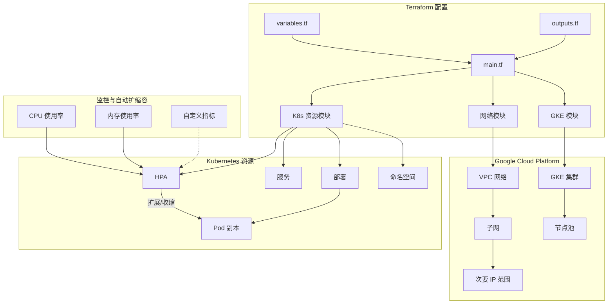

# GCP Terraform HPA 实现

本项目使用 Terraform 在 Google Cloud Platform (GCP) 上实现 Kubernetes 的 Horizontal Pod Autoscaler (HPA) 功能。

## 架构图

详细的架构图可在 [docs/architecture.md](docs/architecture.md) 中查看。



## 项目结构

```
tf-gcp-hpa/
├── main.tf                 # 主 Terraform 配置文件
├── variables.tf            # 变量定义
├── terraform.tfvars.example # 变量值示例
├── modules/
│   ├── gke/                # GKE 集群模块
│   │   ├── main.tf
│   │   ├── variables.tf
│   │   └── outputs.tf
│   ├── network/            # 网络模块
│   │   ├── main.tf
│   │   ├── variables.tf
│   │   └── outputs.tf
│   └── k8s-resources/      # Kubernetes 资源模块
│       ├── main.tf
│       ├── variables.tf
│       └── outputs.tf
├── docs/
│   └── architecture.md     # 详细架构图
├── README.md               # 中文说明文档
└── README_EN.md            # 英文说明文档
```

## 功能特性

- 创建 GKE 集群
- 自动创建 VPC、子网和次要 IP 范围
- 部署 Kubernetes 资源
- 配置 Horizontal Pod Autoscaler
- 支持基于 CPU 和内存的自动扩缩容
- 支持自定义指标的自动扩缩容（可选）

## 前提条件

1. 安装 [Terraform](https://www.terraform.io/downloads.html) (版本 >= 1.0.0)
2. 安装 [Google Cloud SDK](https://cloud.google.com/sdk/docs/install)
3. 配置 GCP 认证
4. 创建 GCP 项目并启用必要的 API

## 使用方法

### 1. 准备 GCP 环境

```bash
# 登录 Google Cloud
gcloud auth login

# 设置项目
gcloud config set project YOUR_PROJECT_ID

# 启用必要的 API
gcloud services enable container.googleapis.com
```

### 2. 配置变量

复制示例变量文件并编辑:

```bash
cp terraform.tfvars.example terraform.tfvars
```

编辑 `terraform.tfvars` 文件，设置您的 GCP 项目 ID 和其他配置。

### 3. 初始化 Terraform

```bash
terraform init
```

### 4. 查看执行计划

```bash
terraform plan
```

### 5. 应用配置

```bash
terraform apply
```

确认后，Terraform 将创建所有资源。

### 6. 连接到集群

```bash
gcloud container clusters get-credentials gke-hpa-demo --region asia-east1
```

### 7. 测试 HPA

可以使用以下命令生成负载来测试 HPA:

```bash
# 部署负载生成器
kubectl run -i --tty load-generator --rm --image=busybox --restart=Never -- /bin/sh -c "while sleep 0.01; do wget -q -O- http://demo-app; done"
```

然后在另一个终端窗口监控 HPA 状态:

```bash
kubectl get hpa -n hpa-demo -w
```

### 8. 清理资源

```bash
terraform destroy
```

## 自定义配置

您可以通过修改 `terraform.tfvars` 文件来自定义配置:

- `project_id`: GCP 项目 ID
- `region`: GCP 区域
- `zone`: GCP 可用区
- `network_name`: VPC 网络名称
- `subnetwork_name`: 子网名称
- `subnet_ip_cidr_range`: 子网 IP CIDR 范围
- `ip_range_pods_cidr`: Pod IP CIDR 范围
- `ip_range_services_cidr`: 服务 IP CIDR 范围
- `app_name`: 应用名称
- `app_image`: 应用容器镜像
- `app_replicas`: 应用初始副本数
- `cpu_threshold`: HPA CPU 使用率阈值百分比
- `min_replicas`: HPA 最小副本数
- `max_replicas`: HPA 最大副本数

## 注意事项

- 本项目默认使用 GCP 的 asia-east1 区域，您可以根据需要修改
- 确保您的 GCP 账户有足够的权限创建和管理 GKE 集群
- 本项目默认创建一个包含 HPA 功能的示例应用，您可以根据需要修改为自己的应用
- 网络模块会自动创建 VPC、子网和次要 IP 范围，无需手动配置
