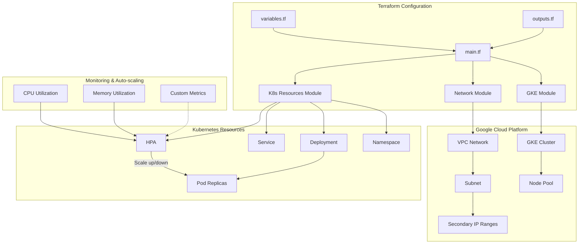

# GCP Terraform HPA Implementation

This project implements Kubernetes Horizontal Pod Autoscaler (HPA) functionality on Google Cloud Platform (GCP) using Terraform.

## Architecture Diagram

Detailed architecture diagram can be found in [docs/architecture.md](docs/architecture.md).



## Project Structure

```
tf-gcp-hpa/
├── main.tf                 # Main Terraform configuration file
├── variables.tf            # Variable definitions
├── terraform.tfvars.example # Example variable values
├── modules/
│   ├── gke/                # GKE cluster module
│   │   ├── main.tf
│   │   ├── variables.tf
│   │   └── outputs.tf
│   ├── network/            # Network module
│   │   ├── main.tf
│   │   ├── variables.tf
│   │   └── outputs.tf
│   └── k8s-resources/      # Kubernetes resources module
│       ├── main.tf
│       ├── variables.tf
│       └── outputs.tf
├── docs/
│   └── architecture.md     # Detailed architecture diagram
├── README.md               # Chinese documentation
└── README_EN.md            # English documentation
```

## Features

- Create a GKE cluster
- Automatically create VPC, subnet, and secondary IP ranges
- Deploy Kubernetes resources
- Configure Horizontal Pod Autoscaler
- Support CPU and memory-based autoscaling
- Support custom metrics-based autoscaling (optional)

## Prerequisites

1. Install [Terraform](https://www.terraform.io/downloads.html) (version >= 1.0.0)
2. Install [Google Cloud SDK](https://cloud.google.com/sdk/docs/install)
3. Configure GCP authentication
4. Create a GCP project and enable necessary APIs

## Usage Instructions

### 1. Prepare GCP Environment

```bash
# Login to Google Cloud
gcloud auth login

# Set project
gcloud config set project YOUR_PROJECT_ID

# Enable necessary APIs
gcloud services enable container.googleapis.com
```

### 2. Configure Variables

Copy the example variable file and edit it:

```bash
cp terraform.tfvars.example terraform.tfvars
```

Edit the `terraform.tfvars` file to set your GCP project ID and other configurations.

### 3. Initialize Terraform

```bash
terraform init
```

### 4. Review Execution Plan

```bash
terraform plan
```

### 5. Apply Configuration

```bash
terraform apply
```

After confirmation, Terraform will create all resources.

### 6. Connect to the Cluster

```bash
gcloud container clusters get-credentials gke-hpa-demo --region asia-east1
```

### 7. Test HPA

You can use the following command to generate load to test HPA:

```bash
# Deploy load generator
kubectl run -i --tty load-generator --rm --image=busybox --restart=Never -- /bin/sh -c "while sleep 0.01; do wget -q -O- http://demo-app; done"
```

Then monitor the HPA status in another terminal window:

```bash
kubectl get hpa -n hpa-demo -w
```

### 8. Clean Up Resources

```bash
terraform destroy
```

## Custom Configuration

You can customize the configuration by modifying the `terraform.tfvars` file:

- `project_id`: GCP project ID
- `region`: GCP region
- `zone`: GCP zone
- `network_name`: VPC network name
- `subnetwork_name`: Subnet name
- `subnet_ip_cidr_range`: Subnet IP CIDR range
- `ip_range_pods_cidr`: Pod IP CIDR range
- `ip_range_services_cidr`: Service IP CIDR range
- `app_name`: Application name
- `app_image`: Application container image
- `app_replicas`: Initial number of application replicas
- `cpu_threshold`: HPA CPU utilization threshold percentage
- `min_replicas`: HPA minimum replicas
- `max_replicas`: HPA maximum replicas

## Notes

- This project uses GCP's asia-east1 region by default, you can modify it as needed
- Ensure your GCP account has sufficient permissions to create and manage GKE clusters
- This project creates a sample application with HPA functionality by default, you can modify it to your own application as needed
- The network module automatically creates VPC, subnet, and secondary IP ranges, no manual configuration is needed
