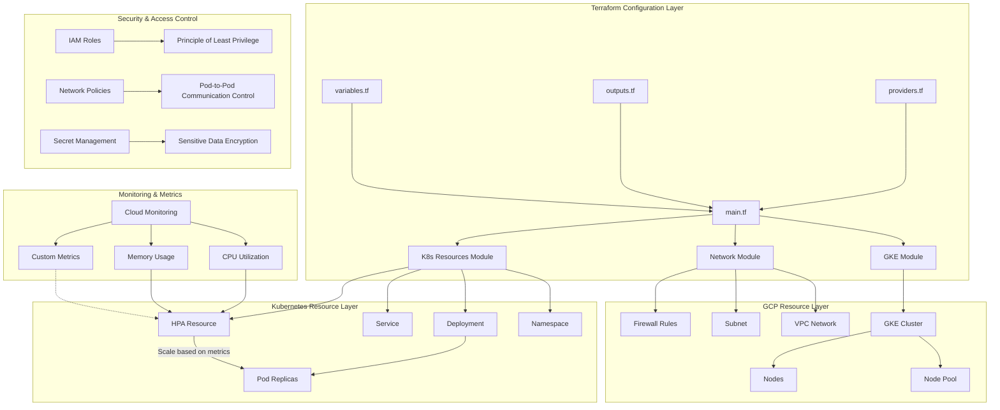
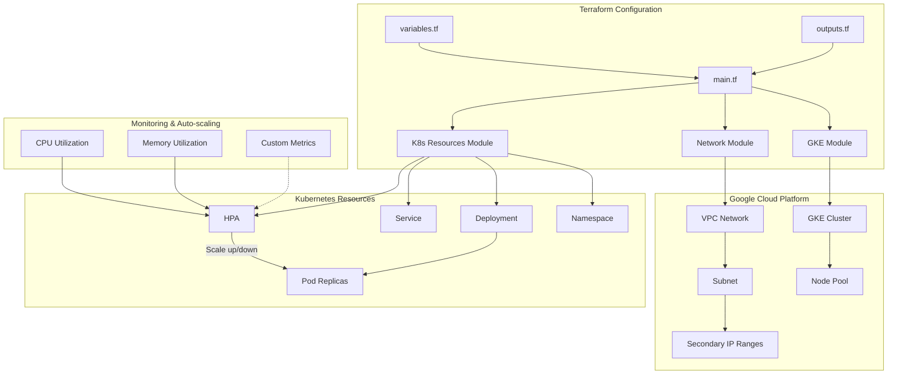

# GCP Terraform HPA Implementation

This project provides a Terraform-based solution for implementing Kubernetes Horizontal Pod Autoscaler (HPA) on Google Cloud Platform (GCP). It offers a complete automation framework to quickly set up a GKE cluster with HPA capabilities and deploy containerized applications with auto-scaling features.

## Architecture Overview

### Core Components



### Component Details

1. **GKE Module**
   - Creates and manages GKE clusters
   - Configures node pools and auto-scaling parameters
   - Sets up cluster-level features (network policies, workload identity, etc.)

2. **Network Module**
   - Creates VPC networks and subnets
   - Configures NAT and Cloud Router
   - Sets up firewall rules
   - Manages IP address ranges for Pods and Services

3. **Kubernetes Resources Module**
   - Deploys application workloads
   - Configures HPA policies
   - Sets up services and ingress
   - Manages configurations and secrets

4. **Monitoring & Alerting**
   - Built-in Prometheus monitoring integration
   - Custom metrics collection
   - Alert rule configuration



## Project Structure

```
tf-gcp-hpa/
├── main.tf                 # Main Terraform configuration file
├── variables.tf            # Variable definitions
├── outputs.tf              # Output definitions
├── providers.tf            # Provider configurations
├── versions.tf             # Version constraints
├── terraform.tfvars.example # Example variable values
├── .gitignore             # Git ignore file
├── modules/               # Terraform modules
│   ├── gke/               # GKE cluster module
│   │   ├── main.tf        # Cluster resources
│   │   ├── variables.tf   # Module variables
│   │   ├── outputs.tf     # Module outputs
│   │   └── README.md      # Module documentation
│   │
│   ├── network/           # Network module
│   │   ├── main.tf        # Network resources
│   │   ├── variables.tf   # Module variables
│   │   ├── outputs.tf     # Module outputs
│   │   └── README.md      # Module documentation
│   │
│   └── k8s-resources/     # Kubernetes resources module
│       ├── main.tf        # K8s resources
│       ├── variables.tf   # Module variables
│       ├── outputs.tf     # Module outputs
│       └── README.md      # Module documentation
│
├── scripts/               # Utility scripts
│   ├── deploy.sh          # Deployment script
│   ├── test-hpa.sh        # HPA testing script
│   └── cleanup.sh         # Cleanup script
│
└── docs/                  # Documentation
    ├── architecture.md    # Detailed architecture
    ├── security.md        # Security guidelines
    ├── monitoring.md      # Monitoring guide
    └── best-practices.md  # Best practices
```

## Key Features

### Infrastructure as Code
- Define and manage all cloud resources using Terraform
- Modular design for maintainability and extensibility
- Support for multiple environments (dev/staging/prod)

### GKE Cluster Management
- Create highly available GKE clusters
- Automatically configure node pools and node auto-scaling
- Support for Workload Identity

### Network Configuration
- Automatically create VPC networks and subnets
- Configure IP address ranges for Pods and Services
- Support for private clusters and authorized networks

### Auto-scaling Capabilities
- CPU-based auto-scaling
- Memory-based auto-scaling
- Support for custom metrics
- Configurable scaling policies

### Monitoring & Logging
- Integrated with Cloud Monitoring and Logging
- Pre-configured HPA monitoring dashboards
- Alerting policies configuration

## Prerequisites

### Software Requirements
1. [Terraform](https://www.terraform.io/downloads.html) (version >= 1.0.0)
2. [Google Cloud SDK](https://cloud.google.com/sdk/docs/install)
3. [kubectl](https://kubernetes.io/docs/tasks/tools/)
4. [git](https://git-scm.com/downloads)

### GCP Configuration
1. Create or select a GCP project
2. Enable the following APIs:
   - Kubernetes Engine API (container.googleapis.com)
   - Compute Engine API (compute.googleapis.com)
   - Cloud Resource Manager API (cloudresourcemanager.googleapis.com)
   - IAM API (iam.googleapis.com)
3. Set up a billing account
4. Create a service account with the following roles:
   - Kubernetes Engine Admin (roles/container.admin)
   - Compute Network Admin (roles/compute.networkAdmin)
   - Service Account User (roles/iam.serviceAccountUser)
   - Storage Admin (roles/storage.admin)

### Authentication Setup

```bash
# Initialize gcloud
$ gcloud init

# Configure application default credentials
$ gcloud auth application-default login

# Set default project
$ gcloud config set project YOUR_PROJECT_ID

# Configure kubectl credentials (run after cluster deployment)
$ gcloud container clusters get-credentials CLUSTER_NAME --region REGION
```

## Usage Instructions

### 1. Prepare GCP Environment

```bash
# Login to Google Cloud
gcloud auth login

# Set project
gcloud config set project YOUR_PROJECT_ID

# Enable necessary APIs
gcloud services enable container.googleapis.com
```

### 2. Configure Variables

Copy the example variable file and edit it:

```bash
cp terraform.tfvars.example terraform.tfvars
```

Edit the `terraform.tfvars` file to set your GCP project ID and other configurations.

### 3. Initialize Terraform

```bash
terraform init
```

### 4. Review Execution Plan

```bash
terraform plan
```

### 5. Apply Configuration

```bash
terraform apply
```

After confirmation, Terraform will create all resources.

### 6. Connect to the Cluster

```bash
gcloud container clusters get-credentials gke-hpa-demo --region asia-east1
```

### 7. Test HPA

You can use the following command to generate load to test HPA:

```bash
# Deploy load generator
kubectl run -i --tty load-generator --rm --image=busybox --restart=Never -- /bin/sh -c "while sleep 0.01; do wget -q -O- http://demo-app; done"
```

Then monitor the HPA status in another terminal window:

```bash
kubectl get hpa -n hpa-demo -w
```

### 8. Clean Up Resources

```bash
terraform destroy
```

## Configuration Guide

### Main Variables

#### GCP Configuration
```hcl
project_id      = "your-project-id"  # Required: GCP Project ID
region          = "asia-east1"       # GCP Region
zone            = "asia-east1-a"     # GCP Zone
environment     = "dev"             # Environment (dev/staging/prod)
cluster_name    = "gke-hpa-demo"    # GKE Cluster Name
```

#### Network Configuration
```hcl
# VPC Network Configuration
network_name    = "vpc-hpa-demo"
subnet_name     = "subnet-hpa-demo"
subnet_ip_cidr_range = "10.10.0.0/20"

# GKE Cluster IP Ranges
ip_range_pods_cidr     = "10.20.0.0/16"  # Pod IP Range
ip_range_services_cidr = "10.30.0.0/16"  # Service IP Range
```

#### GKE Cluster Configuration
```hcl
# Node Pool Configuration
node_pool_name = "default-node-pool"
machine_type   = "e2-medium"         # Machine Type
node_count     = 2                   # Initial Node Count
min_node_count = 1                   # Minimum Node Count
max_node_count = 5                   # Maximum Node Count
preemptible    = false               # Whether to use preemptible instances

# Auto-scaling Configuration
enable_autoscaling = true            # Enable Node Auto-scaling
```

#### Application Deployment
```hcl
# Example Application Configuration
app_name       = "demo-app"
app_image      = "k8s.gcr.io/hpa-example"
app_port       = 80
app_replicas   = 2

# HPA Configuration
hpa_enabled    = true
cpu_threshold  = 70                  # CPU Utilization Threshold (%)
min_replicas   = 1                   # Minimum Pod Replicas
max_replicas   = 10                  # Maximum Pod Replicas
memory_threshold = 80                # Memory Utilization Threshold (%)
```

#### Monitoring & Logging
```hcl
# Monitoring Configuration
monitoring_enabled = true
logging_enabled   = true

# Alerting Configuration
alerting_enabled  = true
alert_email      = "your-email@example.com"
```

### Advanced Configuration

#### Custom VPC Configuration
To use an existing VPC network, set the following variables:

```hcl
create_vpc = false
existing_vpc_name = "your-existing-vpc"
existing_subnet_name = "your-existing-subnet"
```

#### Custom IAM Roles
```hcl
# Custom Service Account
create_service_account = true
service_account_name  = "gke-hpa-sa"
custom_iam_roles = [
  "roles/monitoring.viewer",
  "roles/monitoring.metricWriter",
  "roles/logging.logWriter"
]
```

#### Node Labels and Taints
```hcl
node_labels = {
  "environment" = "dev"
  "team"        = "devops"
}

taints = [
  {
    key    = "dedicated"
    value  = "gpu"
    effect = "NO_SCHEDULE"
  }
]
```

## Best Practices

### Security Best Practices
1. **Principle of Least Privilege**: Assign minimum required permissions to service accounts
2. **Private Clusters**: Use private GKE clusters in production environments
3. **Workload Identity**: Use Workload Identity for secure authentication
4. **Network Policies**: Configure network policies to restrict pod-to-pod communication

### Cost Optimization
1. **Use Preemptible VMs**: Consider using preemptible instances for development and testing
2. **Auto-scaling**: Properly configure HPA and cluster auto-scaling parameters
3. **Node Types**: Choose appropriate machine types based on workload characteristics
4. **Resource Requests/Limits**: Configure appropriate resource requests and limits for containers

### Performance Tuning
1. **HPA Metrics**: Choose appropriate scaling metrics based on application characteristics
2. **Cool-down Periods**: Configure appropriate scaling cool-down periods to avoid thrashing
3. **Resource Quotas**: Set namespace resource quotas to prevent resource abuse
4. **Pod Affinity/Anti-affinity**: Use pod affinity/anti-affinity rules to optimize scheduling

## Troubleshooting

### Common Issues

#### HPA Not Scaling
```bash
# Check if metrics-server is running
kubectl get deployment metrics-server -n kube-system

# Check HPA status
kubectl describe hpa <hpa-name> -n <namespace>

# Check metrics-server logs
kubectl logs -l k8s-app=metrics-server -n kube-system
```

#### Pods Not Scheduling
```bash
# Check node resource usage
kubectl describe nodes | grep -A 5 "Allocated resources"

# Check node status
kubectl get nodes -o wide

# Check events
kubectl get events --sort-by='.metadata.creationTimestamp'
```

#### Network Connectivity Issues
```bash
# Check network policies
kubectl get networkpolicies --all-namespaces

# Check service endpoints
kubectl get endpoints <service-name>

# Check network plugin logs
kubectl logs -n kube-system -l k8s-app=cilium  # If using Cilium
```

## Monitoring & Alerting

### Built-in Monitoring
The project integrates with Cloud Monitoring and provides:
- Cluster resource utilization
- Pod and container CPU/memory usage
- HPA scaling events
- Node health status

### Custom Monitoring
You can add custom monitoring by:

1. **Custom Metrics**:
   - Deploy Prometheus Adapter
   - Configure custom metrics API
   - Reference custom metrics in HPA

2. **Alerting Policies**:
   - Configure alert rules in `modules/monitoring`
   - Set up notification channels (email, Slack, etc.)
   - Define thresholds and durations

## Backup & Recovery

### State File Backup
```hcl
# Configure remote state storage
terraform {
  backend "gcs" {
    bucket = "your-tfstate-bucket"
    prefix = "terraform/state"
  }
}
```

### Application Data Backup
1. Configure Velero for Kubernetes resource backup
2. Set up scheduled backups
3. Test recovery procedures

## Version Upgrades

### Terraform Upgrades
1. Update `required_version` constraints
2. Run `terraform init -upgrade`
3. Test configuration compatibility

### GKE Upgrades
1. Check GKE release notes
2. Create test cluster with new version
3. Schedule upgrade during maintenance window
4. Monitor upgrade progress

## Security Considerations

1. **Sensitive Information**:
   - Use Secret Manager for sensitive data
   - Avoid hardcoding credentials in configuration

2. **Image Security**:
   - Use private container registry
   - Scan images for vulnerabilities
   - Implement image signature verification

3. **Network Isolation**:
   - Use network policies to restrict pod communication
   - Configure VPC Service Controls
   - Enable private endpoints

4. **Audit Logging**:
   - Enable Kubernetes audit logging
   - Monitor for suspicious API calls
   - Set up alerting policies

## Contributing

We welcome contributions! Here's how you can help:

1. Fork the repository
2. Create a feature branch (`git checkout -b feature/AmazingFeature`)
3. Commit your changes (`git commit -m 'Add some AmazingFeature'`)
4. Push to the branch (`git push origin feature/AmazingFeature`)
5. Open a Pull Request

## License

This project is licensed under the MIT License - see the [LICENSE](LICENSE) file for details.

## Support

If you need help or run into issues, please:

1. Check the [FAQ](#faq) section
2. Open an [Issue](https://github.com/your-org/hkc/issues)
3. Join our [Slack channel](#) for real-time support
