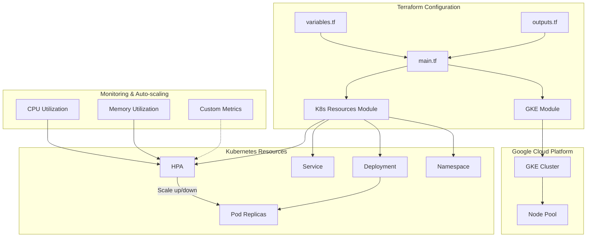

# GCP Terraform HPA Implementation

This project implements Kubernetes Horizontal Pod Autoscaler (HPA) functionality on Google Cloud Platform (GCP) using Terraform.

## Architecture Diagram



## Project Structure

```
tf-gcp-hpa/
├── main.tf                 # Main Terraform configuration file
├── variables.tf            # Variable definitions
├── outputs.tf              # Output definitions
├── terraform.tfvars.example # Example variable values
├── modules/
│   ├── gke/                # GKE cluster module
│   │   ├── main.tf         # GKE cluster resource definitions
│   │   ├── variables.tf    # Module variables
│   │   └── outputs.tf      # Module outputs
│   └── k8s-resources/      # Kubernetes resources module
│       ├── main.tf         # K8s resources definitions (including HPA)
│       ├── variables.tf    # Module variables
│       └── outputs.tf      # Module outputs
└── scripts/
    └── test-hpa.sh         # Script to test HPA functionality
```

## Prerequisites

1. Google Cloud Platform account with billing enabled
2. Google Cloud SDK installed and configured
3. Terraform installed (version 1.0.0+)
4. kubectl installed

## Usage

### 1. Prepare Configuration

Copy the example variables file and modify it according to your needs:

```bash
cp terraform.tfvars.example terraform.tfvars
```

Edit `terraform.tfvars` to set your GCP project ID, region, and other configuration parameters.

### 2. Initialize Terraform

```bash
terraform init
```

### 3. Plan and Apply

```bash
terraform plan
terraform apply
```

### 4. Access the Cluster

After successful deployment, Terraform will output the command to configure kubectl:

```bash
gcloud container clusters get-credentials [CLUSTER_NAME] --region [REGION] --project [PROJECT_ID]
```

### 5. Test HPA Functionality

Use the provided script to test HPA functionality:

```bash
./scripts/test-hpa.sh
```

This script will generate load on the sample application and you can observe how HPA scales the pods.

## HPA Configuration

The HPA is configured to scale based on both CPU and memory utilization:

- CPU target utilization: 50%
- Memory target utilization: 60%
- Min replicas: 2
- Max replicas: 10

You can modify these values in the `terraform.tfvars` file.

## Clean Up

To destroy all resources created by Terraform:

```bash
terraform destroy
```

## Notes

- This implementation uses GKE's built-in monitoring for HPA metrics
- The sample application is a simple web server that can be used to test scaling
- For production use, consider additional security configurations and custom metrics
