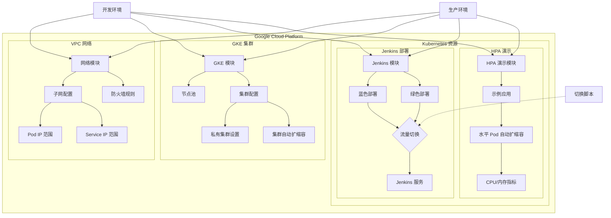
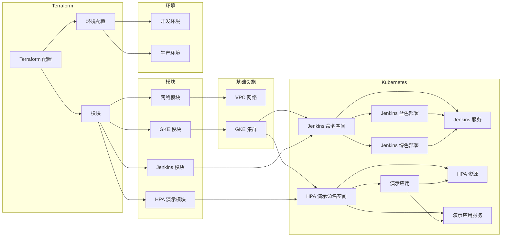

# tf-hsbc-interview

这是一个用于 HSBC 面试演示的 Terraform 项目，展示了如何使用 Terraform 自动化部署 Kubernetes 集群、Jenkins 蓝/绿部署以及 HPA（水平 Pod 自动扩缩容）功能。本项目基于 Google Cloud Platform (GCP) 构建，提供了一套完整的云原生 CI/CD 解决方案。

## 项目概述

本项目是一个综合性的云原生 DevOps 解决方案，专为 HSBC 面试演示设计，展示了现代化云基础设施的最佳实践。通过本项目的实施，您可以快速搭建一个高可用、可扩展的 CI/CD 环境。

### 核心功能

- **基础设施即代码**：使用 Terraform 自动化管理所有云资源
- **Kubernetes 集群**：在 GKE 上部署生产级 Kubernetes 集群
- **CI/CD 流水线**：集成 Jenkins 实现自动化构建和部署
- **蓝绿部署**：实现零停机部署和快速回滚
- **自动扩缩容**：基于 CPU/内存使用率自动调整应用实例数
- **多环境管理**：支持开发、测试和生产环境的独立部署

### 技术栈

- **基础设施**：Google Cloud Platform (GCP)
- **容器编排**：Google Kubernetes Engine (GKE)
- **CI/CD**：Jenkins
- **基础设施即代码**：Terraform
- **监控告警**：Prometheus, Grafana
- **日志管理**：Stackdriver (现为 Cloud Logging)

## 架构图



## 系统要求

### 1. 前提条件

- [Terraform](https://www.terraform.io/downloads.html) >= 1.0.0
- [Google Cloud SDK](https://cloud.google.com/sdk/docs/install)
- [kubectl](https://kubernetes.io/docs/tasks/tools/install-kubectl/)
- [Helm](https://helm.sh/docs/intro/install/) >= 3.0.0
- 有效的 Google Cloud 项目和管理员权限
- 已启用必要的 GCP API

### 2. 资源需求

- **GCP 项目配额**：
  - 至少 8 个 vCPU
  - 至少 32GB 内存
  - 至少 200GB 持久存储
  - 足够的 IP 地址空间

### 3. 网络要求

- 出站互联网访问（用于下载容器镜像）
- 如果使用私有集群，需要配置 Cloud NAT 或代理服务器
- 确保 VPC 网络和子网配置正确

## 项目结构

```
tf-hsbc-interview/
├── environments/           # 环境特定配置
│   ├── dev/                # 开发环境
│   └── prod/               # 生产环境
├── modules/                # 可重用模块
│   ├── blue-green/         # 蓝/绿部署模块
│   ├── gke/                # Google Kubernetes Engine 模块
│   ├── hpa-demo/           # HPA 演示应用模块
│   ├── jenkins/            # Jenkins 模块
│   └── network/            # 网络模块
└── scripts/                # 辅助脚本
```

## 详细功能说明

### 1. 网络配置模块

- **VPC 网络**：创建隔离的虚拟私有云网络
- **子网划分**：为不同环境配置独立的 IP 地址范围
- **防火墙规则**：精细控制入站和出站流量
- **NAT 网关**：为私有集群提供出站互联网访问

### 2. GKE 集群模块

- **集群配置**：支持区域和区域级集群部署
- **节点池管理**：配置工作节点规格和自动扩缩容
- **网络策略**：启用网络策略执行
- **工作负载身份**：安全的服务账户管理
- **私有集群**：增强安全性，限制公共访问

### 3. Jenkins 模块

- **高可用部署**：多副本部署确保高可用性
- **持久化存储**：使用 PersistentVolume 持久化 Jenkins 数据
- **自动扩缩容**：根据负载自动调整 Jenkins 实例数
- **插件管理**：预装常用插件，支持自定义插件列表

### 4. 蓝/绿部署模块

- **零停机部署**：通过服务切换实现无缝更新
- **流量管理**：使用 Kubernetes Service 控制流量路由
- **自动回滚**：检测到问题时自动回滚到上一个版本
- **健康检查**：部署前验证应用健康状态

### 5. HPA 演示模块

- **示例应用**：部署一个可扩展的示例应用
- **自动扩缩容**：基于 CPU/内存使用率自动调整 Pod 数量
- **压力测试**：包含负载生成工具，用于演示自动扩缩容
- **监控指标**：集成 Prometheus 和 Grafana 展示扩缩容指标

## 快速开始指南

### 1. 环境准备

```bash
# 安装必要工具
brew install terraform kubectl helm google-cloud-sdk

# 配置 gcloud 认证
gcloud auth login
gcloud config set project YOUR_PROJECT_ID

# 启用必要的 API
gcloud services enable \
    container.googleapis.com \
    compute.googleapis.com \
    cloudresourcemanager.googleapis.com \
    iam.googleapis.com
```

### 2. 配置项目

1. 复制示例配置文件：
```bash
cp terraform.tfvars.example terraform.tfvars
```

2. 编辑 `terraform.tfvars` 文件，配置必要的参数：
```hcl
project_id       = "your-gcp-project-id"
region           = "asia-east1"
cluster_name     = "hsbc-demo-cluster"
environment      = "dev"

# 网络配置
network_name     = "hsbc-vpc"
subnet_name      = "hsbc-subnet"
subnet_cidr      = "10.0.0.0/20"

# GKE 配置
node_count       = 3
machine_type     = "e2-standard-4"
preemptible      = true

# Jenkins 配置
jenkins_admin_username = "admin"
jenkins_admin_password = "secure-password-here"
```

### 3. 初始化 Terraform

```bash
# 初始化 Terraform 和提供程序
terraform init

# 查看执行计划
terraform plan
```

### 4. 部署基础设施

```bash
# 应用配置
terraform apply

# 等待部署完成（约 10-15 分钟）
```

### 5. 访问 Jenkins

```bash
# 获取 Jenkins 访问 URL
terraform output jenkins_url

# 获取管理员密码
kubectl get secret --namespace jenkins jenkins -o jsonpath="{.data.jenkins-admin-password}" | base64 --decode
```

## 组件关系图



## 前提条件

- Google Cloud Platform 账号
- 已安装 Terraform v1.0.0+
- 已安装 Google Cloud SDK
- 已配置 GCP 认证

## 使用方法

### 初始化项目

```bash
# 切换到开发环境目录
cd environments/dev

# 初始化 Terraform
terraform init
```

### 部署基础设施

```bash
# 创建执行计划
terraform plan -var="project_id=YOUR_GCP_PROJECT_ID" -out=plan.out

# 应用执行计划
terraform apply plan.out
```

### 切换蓝/绿部署

```bash
# 切换到绿色部署
terraform apply -var="project_id=YOUR_GCP_PROJECT_ID" -var="blue_deployment_active=false"

# 切换回蓝色部署
terraform apply -var="project_id=YOUR_GCP_PROJECT_ID" -var="blue_deployment_active=true"
```

### 测试蓝/绿部署

部署完成后，可以通过以下步骤测试和验证蓝/绿部署功能：

1. 查看当前运行的 Jenkins Pod
```bash
kubectl get pods -n dev-jenkins -l app=jenkins
```

2. 检查蓝/绿服务的当前路由目标
```bash
kubectl describe service jenkins-blue-green -n dev-jenkins
```
## 监控与告警

### 1. 访问监控仪表板

```bash
# 端口转发到本地
kubectl port-forward -n monitoring svc/prometheus-server 9090:80 &
kubectl port-forward -n monitoring svc/grafana 3000:80 &

# 访问地址
# Prometheus: http://localhost:9090
# Grafana: http://localhost:3000 (admin/prom-operator)
```

### 2. 配置告警规则

1. 在 Prometheus 中配置告警规则
2. 设置 Alertmanager 接收告警
3. 配置通知渠道（Email、Slack、PagerDuty 等）

### 3. 查看日志

```bash
# 查看 Jenkins 日志
kubectl logs -f -n jenkins -l app.kubernetes.io/component=jenkins-controller

# 查看应用日志
kubectl logs -f -n hpa-demo -l app=hpa-demo

# 查看系统组件日志
gcloud logging read 'resource.type="k8s_container"' --limit=50 --format="table(timestamp,resource.labels.container_name,textPayload)"
```

## 安全加固

### 1. 网络策略

默认启用的网络策略限制 Pod 间通信：

```yaml
# 示例：只允许特定命名空间内的 Pod 通信
apiVersion: networking.k8s.io/v1
kind: NetworkPolicy
metadata:
  name: default-deny-all
  namespace: default
spec:
  podSelector: {}
  policyTypes:
  - Ingress
  - Egress
```

### 2. 密钥管理

使用 Kubernetes Secrets 或外部密钥管理系统：

```bash
# 创建加密密钥
kubectl create secret generic app-secrets \
  --from-literal=db-password='your-secure-password' \
  --namespace=your-namespace
```

### 3. 安全上下文

为 Pod 和容器配置安全上下文：

```yaml
securityContext:
  runAsNonRoot: true
  runAsUser: 1000
  fsGroup: 2000
  allowPrivilegeEscalation: false
  capabilities:
    drop: ["ALL"]
```

## 维护与排错

### 1. 常见问题

#### 1.1 部署失败

```bash
# 查看部署状态
kubectl get pods --all-namespaces

# 查看事件
kubectl get events --sort-by='.metadata.creationTimestamp'

# 描述有问题的 Pod
kubectl describe pod <pod-name> -n <namespace>
```

#### 1.2 网络问题

```bash
# 检查服务状态
kubectl get svc --all-namespaces

# 检查入口控制器
kubectl get ingress --all-namespaces

# 检查网络策略
kubectl get networkpolicies --all-namespaces
```

### 2. 性能调优

#### 2.1 调整资源限制

```hcl
# 在 terraform.tfvars 中调整资源限制
jenkins_resources = {
  master = {
    limits = {
      cpu    = "4000m"
      memory = "8192Mi"
    }
  }
}
```

#### 2.2 优化 JVM 参数

```hcl
jenkins_java_opts = "-Xms2048m -Xmx4096m -XX:MaxMetaspaceSize=512m -XX:MaxRAMFraction=2 -XX:+UseContainerSupport -XX:+UseG1GC"
```

## 最佳实践

### 1. 生产环境建议

- 使用专用节点池运行关键工作负载
- 为生产环境启用私有集群
- 配置定期备份
- 实施细粒度的访问控制
- 定期更新容器镜像和依赖项

### 2. 安全建议

- 限制对 Kubernetes API 的访问
- 使用工作负载身份进行服务认证
- 定期轮换凭据和密钥
- 审计集群活动
- 启用网络策略和 Pod 安全策略

### 3. 成本优化

- 使用抢占式实例降低成本
- 配置集群自动扩缩容
- 设置预算提醒
- 定期清理未使用的资源

## 贡献指南

欢迎贡献代码和文档！提交 PR 前请确保：

1. 代码符合项目规范
2. 包含必要的测试
3. 更新相关文档
4. 提交信息清晰明确

## 许可证

本项目采用 [MIT 许可证](LICENSE)

## 致谢

- [Terraform](https://www.terraform.io/)
- [Google Cloud](https://cloud.google.com/)
- [Kubernetes](https://kubernetes.io/)
- [Jenkins](https://www.jenkins.io/)

## 注意事项

- 首次访问 Jenkins 时，需要获取初始管理员密码
- 蓝绿部署使用了两个独立的部署，确保它们之间的配置同步
- 生产环境中应使用更严格的安全配置

## 故障排除

在输出中查找 `Selector` 字段，它会显示当前服务指向的是蓝色还是绿色部署（`version=blue` 或 `version=green`）。

3. 切换部署版本
```bash
# 切换到绿色部署
terraform apply -var="project_id=YOUR_GCP_PROJECT_ID" -var="blue_deployment_active=false"
```

4. 验证服务流量切换
```bash
# 等待几分钟让变更生效
kubectl describe service jenkins-blue-green -n dev-jenkins
```
确认 `Selector` 已更新为 `version=green`。

5. 验证 Pod 数量变化
```bash
# 查看蓝色部署的 Pod 数量（应为 0）
kubectl get deployment jenkins-blue -n dev-jenkins

# 查看绿色部署的 Pod 数量（应为 1）
kubectl get deployment jenkins-green -n dev-jenkins
```

6. 访问 Jenkins 服务验证功能正常
```bash
# 获取 Jenkins 服务的外部 IP
kubectl get service jenkins-blue-green -n dev-jenkins
```
使用浏览器访问 `http://<EXTERNAL-IP>` 确认 Jenkins 正常运行。

7. 切换回蓝色部署并重复验证步骤
```bash
terraform apply -var="project_id=YOUR_GCP_PROJECT_ID" -var="blue_deployment_active=true"
```

### 测试 HPA

部署完成后，可以通过以下步骤测试 HPA 功能：

1. 获取 HPA 演示应用的 URL
```bash
terraform output hpa_demo_url
```

2. 使用负载测试工具（如 Apache Bench）向应用发送请求
```bash
ab -n 1000 -c 100 http://HPA_DEMO_URL/
```

3. 观察 Pod 自动扩缩容
```bash
kubectl get hpa -n dev-hpa-demo -w
```

### 自定义网络

本项目支持通过多种方式自定义网络配置：

#### 1. 使用 terraform.tfvars 文件

在环境目录（如 `environments/dev` 或 `environments/prod`）中创建 `terraform.tfvars` 文件，添加以下变量：

```hcl
# 网络配置
network_name          = "custom-hsbc-vpc"
subnet_name           = "custom-hsbc-subnet"
subnet_ip_cidr_range  = "10.0.0.0/20"  # 自定义子网 CIDR
ip_range_pods_cidr     = "10.10.0.0/16"  # 自定义 Pod IP 范围
ip_range_services_cidr = "10.20.0.0/16"  # 自定义 Service IP 范围
```

项目根目录下提供了 `terraform.tfvars.example` 示例文件，您可以复制到相应环境目录并按需修改：

```bash
# 复制到开发环境
cp terraform.tfvars.example environments/dev/terraform.tfvars

# 复制到生产环境
cp terraform.tfvars.example environments/prod/terraform.tfvars
```

#### 2. 通过命令行参数

在执行 `terraform apply` 时通过 `-var` 参数传递：

```bash
terraform apply \
  -var="project_id=YOUR_GCP_PROJECT_ID" \
  -var="network_name=custom-hsbc-vpc" \
  -var="subnet_ip_cidr_range=10.0.0.0/20" \
  -var="ip_range_pods_cidr=10.10.0.0/16" \
  -var="ip_range_services_cidr=10.20.0.0/16"
```

#### 3. 可自定义的网络参数

| 参数 | 描述 | 默认值 |
|------|------|--------|
| `network_name` | VPC 网络名称 | `hsbc-demo-vpc` |
| `subnet_name` | 子网名称 | `hsbc-demo-subnet` |
| `subnet_ip_cidr_range` | 子网 IP CIDR 范围 | `10.0.0.0/24` |
| `ip_range_pods_name` | GKE Pods IP 范围名称 | `ip-range-pods` |
| `ip_range_pods_cidr` | GKE Pods IP CIDR 范围 | `10.1.0.0/16` |
| `ip_range_services_name` | GKE Services IP 范围名称 | `ip-range-services` |
| `ip_range_services_cidr` | GKE Services IP CIDR 范围 | `10.2.0.0/16` |
| `region` | GCP 区域 | `asia-east1` |

#### 4. 高级自定义

如需更复杂的网络配置，可以直接修改 `modules/network/main.tf` 文件，例如添加更多防火墙规则、配置 VPC 对等连接、设置 NAT 网关等。

## 模块说明

### 网络模块

创建 VPC 网络、子网和防火墙规则，支持 GKE 集群的网络需求。

### GKE 模块

配置和部署 Google Kubernetes Engine 集群，包括节点池、自动缩放和安全设置。

### Jenkins 模块

在 Kubernetes 上部署 Jenkins，并支持蓝/绿部署策略。

### HPA 演示模块

部署示例应用并配置 HPA，展示 Kubernetes 水平 Pod 自动扩缩容功能。

## 注意事项

- 确保 GCP 项目已启用以下必要的 API：
  - Compute Engine API (`compute.googleapis.com`)
  - Kubernetes Engine API (`container.googleapis.com`)
  - Container Registry API (`containerregistry.googleapis.com`)
  - Cloud Resource Manager API (`cloudresourcemanager.googleapis.com`)
  - Identity and Access Management (IAM) API (`iam.googleapis.com`)
  - Cloud Monitoring API (`monitoring.googleapis.com`)
  - Cloud Logging API (`logging.googleapis.com`)
  - Service Networking API (`servicenetworking.googleapis.com`)
  - Cloud DNS API (`dns.googleapis.com`)
  - Artifact Registry API (`artifactregistry.googleapis.com`)
- 根据实际需求调整变量文件中的参数
- 生产环境部署前，请确保已进行充分测试
