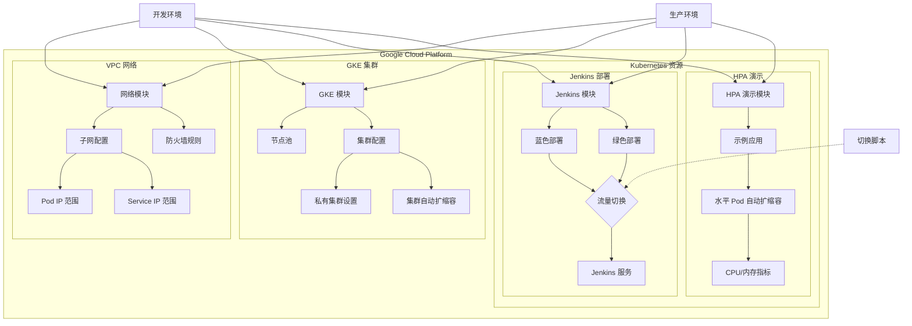
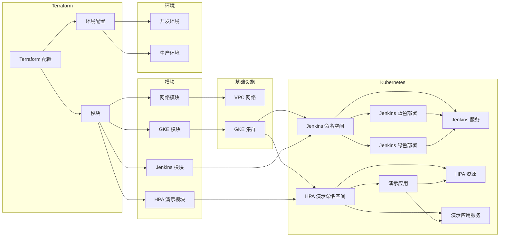

# tf-hsbc-interview

这是一个用于 HSBC 面试演示的 Terraform 项目，展示了如何使用 Terraform 自动化部署 Kubernetes 集群、Jenkins 蓝/绿部署以及 HPA（水平 Pod 自动扩缩容）功能。

## 架构图



## 项目结构

```
tf-hsbc-interview/
├── environments/           # 环境特定配置
│   ├── dev/                # 开发环境
│   └── prod/               # 生产环境
├── modules/                # 可重用模块
│   ├── blue-green/         # 蓝/绿部署模块
│   ├── gke/                # Google Kubernetes Engine 模块
│   ├── hpa-demo/           # HPA 演示应用模块
│   ├── jenkins/            # Jenkins 模块
│   └── network/            # 网络模块
└── scripts/                # 辅助脚本
```

## 功能特性

1. **自定义网络配置**：创建 VPC 网络、子网和防火墙规则
2. **GKE 集群部署**：配置和部署 Google Kubernetes Engine 集群
3. **Jenkins 部署**：在 Kubernetes 上部署 Jenkins
4. **蓝/绿部署**：实现 Jenkins 的蓝/绿部署策略
5. **HPA 演示**：展示 Kubernetes 水平 Pod 自动扩缩容功能

## 组件关系图



## 前提条件

- Google Cloud Platform 账号
- 已安装 Terraform v1.0.0+
- 已安装 Google Cloud SDK
- 已配置 GCP 认证

## 使用方法

### 初始化项目

```bash
# 切换到开发环境目录
cd environments/dev

# 初始化 Terraform
terraform init
```

### 部署基础设施

```bash
# 创建执行计划
terraform plan -var="project_id=YOUR_GCP_PROJECT_ID" -out=plan.out

# 应用执行计划
terraform apply plan.out
```

### 切换蓝/绿部署

```bash
# 切换到绿色部署
terraform apply -var="project_id=YOUR_GCP_PROJECT_ID" -var="blue_deployment_active=false"

# 切换回蓝色部署
terraform apply -var="project_id=YOUR_GCP_PROJECT_ID" -var="blue_deployment_active=true"
```

### 测试 HPA

部署完成后，可以通过以下步骤测试 HPA 功能：

1. 获取 HPA 演示应用的 URL
```bash
terraform output hpa_demo_url
```

2. 使用负载测试工具（如 Apache Bench）向应用发送请求
```bash
ab -n 1000 -c 100 http://HPA_DEMO_URL/
```

3. 观察 Pod 自动扩缩容
```bash
kubectl get hpa -n dev-hpa-demo -w
```

## 模块说明

### 网络模块

创建 VPC 网络、子网和防火墙规则，支持 GKE 集群的网络需求。

### GKE 模块

配置和部署 Google Kubernetes Engine 集群，包括节点池、自动缩放和安全设置。

### Jenkins 模块

在 Kubernetes 上部署 Jenkins，并支持蓝/绿部署策略。

### HPA 演示模块

部署示例应用并配置 HPA，展示 Kubernetes 水平 Pod 自动扩缩容功能。

## 注意事项

- 确保 GCP 项目已启用以下必要的 API：
  - Compute Engine API (`compute.googleapis.com`)
  - Kubernetes Engine API (`container.googleapis.com`)
  - Container Registry API (`containerregistry.googleapis.com`)
  - Cloud Resource Manager API (`cloudresourcemanager.googleapis.com`)
  - Identity and Access Management (IAM) API (`iam.googleapis.com`)
  - Cloud Monitoring API (`monitoring.googleapis.com`)
  - Cloud Logging API (`logging.googleapis.com`)
  - Service Networking API (`servicenetworking.googleapis.com`)
  - Cloud DNS API (`dns.googleapis.com`)
  - Artifact Registry API (`artifactregistry.googleapis.com`)
- 根据实际需求调整变量文件中的参数
- 生产环境部署前，请确保已进行充分测试
