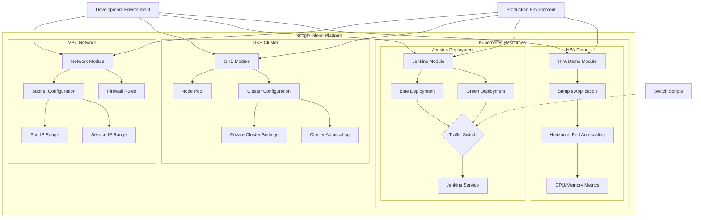
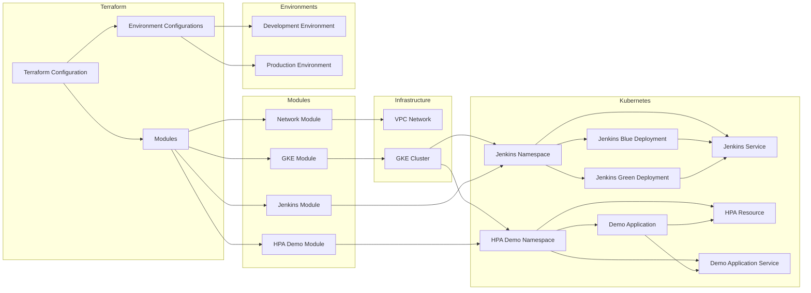

# tf-hsbc-interview

This is a Terraform project for HSBC interview demonstration, showcasing how to use Terraform to automate the deployment of Kubernetes clusters, Jenkins blue/green deployments, and HPA (Horizontal Pod Autoscaling) functionality.

## Architecture Diagram



## Project Structure

```
tf-hsbc-interview/
├── environments/           # Environment-specific configurations
│   ├── dev/                # Development environment
│   └── prod/               # Production environment
├── modules/                # Reusable modules
│   ├── blue-green/         # Blue/Green deployment module
│   ├── gke/                # Google Kubernetes Engine module
│   ├── hpa-demo/           # HPA demonstration application module
│   ├── jenkins/            # Jenkins module
│   └── network/            # Network module
└── scripts/                # Helper scripts
```

## Features

1. **Custom Network Configuration**: Create VPC networks, subnets, and firewall rules
2. **GKE Cluster Deployment**: Configure and deploy Google Kubernetes Engine clusters
3. **Jenkins Deployment**: Deploy Jenkins on Kubernetes
4. **Blue/Green Deployment**: Implement blue/green deployment strategy for Jenkins
5. **HPA Demonstration**: Showcase Kubernetes Horizontal Pod Autoscaling functionality

## Component Relationship Diagram



## Prerequisites

- Google Cloud Platform account
- Terraform v1.0.0+ installed
- Google Cloud SDK installed
- GCP authentication configured

## Usage

### Initialize the Project

```bash
# Change to the development environment directory
cd environments/dev

# Initialize Terraform
terraform init
```

### Deploy Infrastructure

```bash
# Create execution plan
terraform plan -var="project_id=YOUR_GCP_PROJECT_ID" -out=plan.out

# Apply execution plan
terraform apply plan.out
```

### Switch Blue/Green Deployment

```bash
# Switch to green deployment
terraform apply -var="project_id=YOUR_GCP_PROJECT_ID" -var="blue_deployment_active=false"

# Switch back to blue deployment
terraform apply -var="project_id=YOUR_GCP_PROJECT_ID" -var="blue_deployment_active=true"
```

### Test HPA

After deployment, you can test the HPA functionality with the following steps:

1. Get the URL of the HPA demo application
```bash
terraform output hpa_demo_url
```

2. Send requests to the application using a load testing tool (e.g., Apache Bench)
```bash
ab -n 1000 -c 100 http://HPA_DEMO_URL/
```

3. Observe Pod autoscaling
```bash
kubectl get hpa -n dev-hpa-demo -w
```

## Module Descriptions

### Network Module

Creates VPC networks, subnets, and firewall rules to support the network requirements of GKE clusters.

### GKE Module

Configures and deploys Google Kubernetes Engine clusters, including node pools, autoscaling, and security settings.

### Jenkins Module

Deploys Jenkins on Kubernetes and supports blue/green deployment strategy.

### HPA Demo Module

Deploys a sample application and configures HPA to demonstrate Kubernetes Horizontal Pod Autoscaling functionality.

## Notes

- Ensure that the following necessary APIs are enabled in your GCP project:
  - Compute Engine API (`compute.googleapis.com`)
  - Kubernetes Engine API (`container.googleapis.com`)
  - Container Registry API (`containerregistry.googleapis.com`)
  - Cloud Resource Manager API (`cloudresourcemanager.googleapis.com`)
  - Identity and Access Management (IAM) API (`iam.googleapis.com`)
  - Cloud Monitoring API (`monitoring.googleapis.com`)
  - Cloud Logging API (`logging.googleapis.com`)
  - Service Networking API (`servicenetworking.googleapis.com`)
  - Cloud DNS API (`dns.googleapis.com`)
  - Artifact Registry API (`artifactregistry.googleapis.com`)
- Adjust parameters in the variable files according to your actual requirements
- Ensure thorough testing before deploying to production environments
