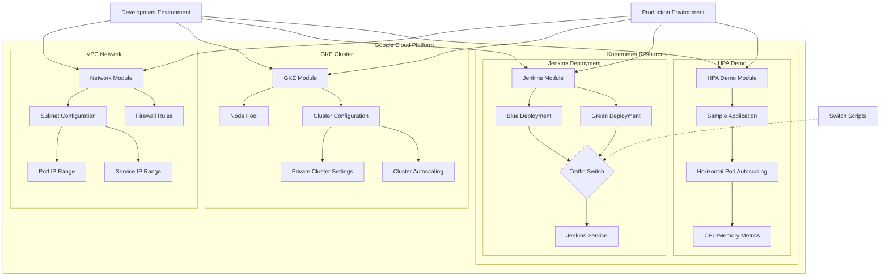
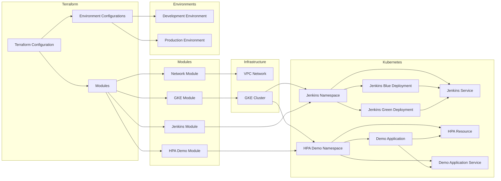

# tf-hsbc-interview

This is a Terraform project for HSBC interview demonstration, showcasing how to use Terraform to automate the deployment of Kubernetes clusters, Jenkins blue/green deployments, and HPA (Horizontal Pod Autoscaling) functionality. Built on Google Cloud Platform (GCP), this project provides a complete cloud-native CI/CD solution.

## Project Overview

This project is a comprehensive cloud-native DevOps solution designed for HSBC interview demonstrations, showcasing best practices in modern cloud infrastructure. By implementing this project, you can quickly set up a highly available and scalable CI/CD environment.

### Core Features

- **Infrastructure as Code**: Use Terraform to automate all cloud resource management
- **Kubernetes Cluster**: Deploy production-grade Kubernetes clusters on GKE
- **CI/CD Pipeline**: Integrate Jenkins for automated building and deployment
- **Blue/Green Deployment**: Achieve zero-downtime deployments and quick rollbacks
- **Auto-scaling**: Automatically adjust application instances based on CPU/memory usage
- **Multi-environment Management**: Support independent deployments for development, testing, and production environments

### Technology Stack

- **Infrastructure**: Google Cloud Platform (GCP)
- **Container Orchestration**: Google Kubernetes Engine (GKE)
- **CI/CD**: Jenkins
- **Infrastructure as Code**: Terraform
- **Monitoring & Alerting**: Prometheus, Grafana
- **Log Management**: Stackdriver (now Cloud Logging)

## System Requirements

### 1. Prerequisites

- [Terraform](https://www.terraform.io/downloads.html) >= 1.0.0
- [Google Cloud SDK](https://cloud.google.com/sdk/docs/install)
- [kubectl](https://kubernetes.io/docs/tasks/tools/install-kubectl/)
- [Helm](https://helm.sh/docs/intro/install/) >= 3.0.0
- Valid Google Cloud project with admin privileges
- Required GCP APIs enabled

### 2. Resource Requirements

- **GCP Project Quota**:
  - At least 8 vCPUs
  - At least 32GB RAM
  - At least 200GB persistent storage
  - Sufficient IP address space

### 3. Network Requirements

- Outbound internet access (for downloading container images)
- If using private clusters, configure Cloud NAT or proxy server
- Ensure VPC network and subnet configurations are correct

## Architecture Diagram



## Project Structure

```
tf-hsbc-interview/
├── environments/           # Environment-specific configurations
│   ├── dev/                # Development environment
│   └── prod/               # Production environment
├── modules/                # Reusable modules
│   ├── blue-green/         # Blue/Green deployment module
│   ├── gke/                # Google Kubernetes Engine module
│   ├── hpa-demo/           # HPA demonstration application module
│   ├── jenkins/            # Jenkins module
│   └── network/            # Network module
└── scripts/                # Helper scripts
```

## Detailed Feature Description

### 1. Network Configuration Module

- **VPC Network**: Create isolated virtual private cloud networks
- **Subnet Division**: Configure independent IP address ranges for different environments
- **Firewall Rules**: Fine-grained control over inbound and outbound traffic
- **NAT Gateway**: Provide outbound internet access for private clusters

### 2. GKE Cluster Module

- **Cluster Configuration**: Support for regional and zonal cluster deployments
- **Node Pool Management**: Configure worker node specifications and auto-scaling
- **Network Policies**: Enable network policy enforcement
- **Workload Identity**: Secure service account management
- **Private Clusters**: Enhanced security with restricted public access

### 3. Jenkins Module

- **High Availability Deployment**: Multi-replica deployment ensures high availability
- **Persistent Storage**: Use PersistentVolume for Jenkins data persistence
- **Auto-scaling**: Automatically adjust Jenkins instances based on load
- **Plugin Management**: Pre-installed common plugins with support for custom plugin lists

### 4. Blue/Green Deployment Module

- **Zero-downtime Deployment**: Seamless updates through service switching
- **Traffic Management**: Control traffic routing using Kubernetes Service
- **Automatic Rollback**: Automatically roll back to the previous version if issues are detected
- **Health Checks**: Verify application health status before deployment

### 5. HPA Demo Module

- **Sample Application**: Deploy a scalable sample application
- **Auto-scaling**: Automatically adjust the number of Pods based on CPU/memory usage
- **Load Testing**: Includes load generation tools for demonstrating auto-scaling
- **Monitoring Metrics**: Integrated Prometheus and Grafana for scaling metrics visualization

```
tf-hsbc-interview/
├── environments/           # Environment-specific configurations
│   ├── dev/                # Development environment
│   └── prod/               # Production environment
├── modules/                # Reusable modules
│   ├── blue-green/         # Blue/Green deployment module
│   ├── gke/                # Google Kubernetes Engine module
│   ├── hpa-demo/           # HPA demonstration application module
│   ├── jenkins/            # Jenkins module
│   └── network/            # Network module
└── scripts/                # Helper scripts
```

## Quick Start Guide

### 1. Environment Setup

```bash
# Install required tools
brew install terraform kubectl helm google-cloud-sdk

# Configure gcloud authentication
gcloud auth login
gcloud config set project YOUR_PROJECT_ID

# Enable required APIs
gcloud services enable \
    container.googleapis.com \
    compute.googleapis.com \
    cloudresourcemanager.googleapis.com \
    iam.googleapis.com
```

### 2. Project Configuration

1. Copy the example configuration file:
```bash
cp terraform.tfvars.example terraform.tfvars
```

2. Edit the `terraform.tfvars` file with necessary parameters:
```hcl
project_id       = "your-gcp-project-id"
region           = "asia-east1"
cluster_name     = "hsbc-demo-cluster"
environment      = "dev"

# Network configuration
network_name     = "hsbc-vpc"
subnet_name      = "hsbc-subnet"
subnet_cidr      = "10.0.0.0/20"

# GKE configuration
node_count       = 3
machine_type     = "e2-standard-4"
preemptible      = true

# Jenkins configuration
jenkins_admin_username = "admin"
jenkins_admin_password = "secure-password-here"
```

### 3. Initialize Terraform

```bash
# Initialize Terraform and providers
terraform init

# Review the execution plan
terraform plan
```

### 4. Deploy Infrastructure

```bash
# Apply the configuration
terraform apply

# Wait for deployment to complete (approximately 10-15 minutes)
```

### 5. Access Jenkins

```bash
# Get Jenkins URL
terraform output jenkins_url

# Get admin password
kubectl get secret --namespace jenkins jenkins -o jsonpath="{.data.jenkins-admin-password}" | base64 --decode
```

## Monitoring and Alerting

### 1. Access Monitoring Dashboards

```bash
# Port forward to localhost
kubectl port-forward -n monitoring svc/prometheus-server 9090:80 &
kubectl port-forward -n monitoring svc/grafana 3000:80 &

# Access URLs
# Prometheus: http://localhost:9090
# Grafana: http://localhost:3000 (admin/prom-operator)
```

### 2. Configure Alert Rules

1. Set up alert rules in Prometheus
2. Configure Alertmanager to receive alerts
3. Set up notification channels (Email, Slack, PagerDuty, etc.)

### 3. View Logs

```bash
# View Jenkins logs
kubectl logs -f -n jenkins -l app.kubernetes.io/component=jenkins-controller

# View application logs
kubectl logs -f -n hpa-demo -l app=hpa-demo

# View system component logs
gcloud logging read 'resource.type="k8s_container"' --limit=50 --format="table(timestamp,resource.labels.container_name,textPayload)"
```

## Security Hardening

### 1. Network Policies

Default network policies restrict pod-to-pod communication:

```yaml
# Example: Only allow communication between pods in specific namespaces
apiVersion: networking.k8s.io/v1
kind: NetworkPolicy
metadata:
  name: default-deny-all
  namespace: default
spec:
  podSelector: {}
  policyTypes:
  - Ingress
  - Egress
```

### 2. Secret Management

Use Kubernetes Secrets or external secret management systems:

```bash
# Create an encrypted secret
kubectl create secret generic app-secrets \
  --from-literal=db-password='your-secure-password' \
  --namespace=your-namespace
```

### 3. Security Context

Configure security context for Pods and containers:

```yaml
securityContext:
  runAsNonRoot: true
  runAsUser: 1000
  fsGroup: 2000
  allowPrivilegeEscalation: false
  capabilities:
    drop: ["ALL"]
```

## Maintenance and Troubleshooting

### 1. Common Issues

#### 1.1 Deployment Failures

```bash
# Check deployment status
kubectl get pods --all-namespaces

# View events
kubectl get events --sort-by='.metadata.creationTimestamp'

# Describe problematic pod
kubectl describe pod <pod-name> -n <namespace>
```

#### 1.2 Network Issues

```bash
# Check service status
kubectl get svc --all-namespaces

# Check ingress controller
kubectl get ingress --all-namespaces

# Check network policies
kubectl get networkpolicies --all-namespaces
```

### 2. Performance Tuning

#### 2.1 Adjust Resource Limits

```hcl
# Adjust resource limits in terraform.tfvars
jenkins_resources = {
  master = {
    limits = {
      cpu    = "4000m"
      memory = "8192Mi"
    }
  }
}
```

#### 2.2 Optimize JVM Parameters

```hcl
jenkins_java_opts = "-Xms2048m -Xmx4096m -XX:MaxMetaspaceSize=512m -XX:MaxRAMFraction=2 -XX:+UseContainerSupport -XX:+UseG1GC"
```

## Best Practices

### 1. Production Recommendations

- Use dedicated node pools for critical workloads
- Enable private clusters for production environments
- Configure regular backups
- Implement fine-grained access controls
- Regularly update container images and dependencies

### 2. Security Recommendations

- Restrict access to Kubernetes API
- Use Workload Identity for service authentication
- Regularly rotate credentials and secrets
- Audit cluster activities
- Enable network policies and pod security policies

### 3. Cost Optimization

- Use preemptible instances to reduce costs
- Configure cluster auto-scaling
- Set up budget alerts
- Regularly clean up unused resources

## Contribution Guidelines

Contributions to code and documentation are welcome! Before submitting a PR, please ensure:

1. Code follows project standards
2. Includes necessary tests
3. Updates relevant documentation
4. Has clear commit messages

## License

This project is licensed under the [MIT License](LICENSE)

## Acknowledgments

- [Terraform](https://www.terraform.io/)
- [Google Cloud](https://cloud.google.com/)
- [Kubernetes](https://kubernetes.io/)
- [Jenkins](https://www.jenkins.io/)

## Notes

- Initial admin password is required on first Jenkins access
- Blue/Green deployment uses two independent deployments - ensure configuration sync between them
- Stricter security configurations should be used in production environments

## Component Relationship Diagram



## Prerequisites

- Google Cloud Platform account
- Terraform v1.0.0+ installed
- Google Cloud SDK installed
- GCP authentication configured

## Usage

### Initialize the Project

```bash
# Change to the development environment directory
cd environments/dev

# Initialize Terraform
terraform init
```

### Deploy Infrastructure

```bash
# Create execution plan
terraform plan -var="project_id=YOUR_GCP_PROJECT_ID" -out=plan.out

# Apply execution plan
terraform apply plan.out
```

### Switch Blue/Green Deployment

```bash
# Switch to green deployment
terraform apply -var="project_id=YOUR_GCP_PROJECT_ID" -var="blue_deployment_active=false"

# Switch back to blue deployment
terraform apply -var="project_id=YOUR_GCP_PROJECT_ID" -var="blue_deployment_active=true"
```

### Test HPA

After deployment, you can test the HPA functionality with the following steps:

1. Get the URL of the HPA demo application
```bash
terraform output hpa_demo_url
```

2. Send requests to the application using a load testing tool (e.g., Apache Bench)
```bash
ab -n 1000 -c 100 http://HPA_DEMO_URL/
```

3. Observe Pod autoscaling
```bash
kubectl get hpa -n dev-hpa-demo -w
```

### Customizing Network

This project supports customizing network configuration through multiple methods:

#### 1. Using terraform.tfvars File

Create a `terraform.tfvars` file in the environment directory (e.g., `environments/dev` or `environments/prod`) and add the following variables:

```hcl
# Network configuration
network_name          = "custom-hsbc-vpc"
subnet_name           = "custom-hsbc-subnet"
subnet_ip_cidr_range  = "10.0.0.0/20"  # Custom subnet CIDR
ip_range_pods_cidr     = "10.10.0.0/16"  # Custom Pod IP range
ip_range_services_cidr = "10.20.0.0/16"  # Custom Service IP range
```

The project root directory provides a `terraform.tfvars.example` sample file that you can copy to the appropriate environment directory and modify as needed:

```bash
# Copy to development environment
cp terraform.tfvars.example environments/dev/terraform.tfvars

# Copy to production environment
cp terraform.tfvars.example environments/prod/terraform.tfvars
```

#### 2. Using Command Line Parameters

Pass variables through the `-var` parameter when executing `terraform apply`:

```bash
terraform apply \
  -var="project_id=YOUR_GCP_PROJECT_ID" \
  -var="network_name=custom-hsbc-vpc" \
  -var="subnet_ip_cidr_range=10.0.0.0/20" \
  -var="ip_range_pods_cidr=10.10.0.0/16" \
  -var="ip_range_services_cidr=10.20.0.0/16"
```

#### 3. Customizable Network Parameters

| Parameter | Description | Default Value |
|------|------|--------|
| `network_name` | VPC network name | `hsbc-demo-vpc` |
| `subnet_name` | Subnet name | `hsbc-demo-subnet` |
| `subnet_ip_cidr_range` | Subnet IP CIDR range | `10.0.0.0/24` |
| `ip_range_pods_name` | GKE Pods IP range name | `ip-range-pods` |
| `ip_range_pods_cidr` | GKE Pods IP CIDR range | `10.1.0.0/16` |
| `ip_range_services_name` | GKE Services IP range name | `ip-range-services` |
| `ip_range_services_cidr` | GKE Services IP CIDR range | `10.2.0.0/16` |
| `region` | GCP region | `asia-east1` |

#### 4. Advanced Customization

For more complex network configurations, you can directly modify the `modules/network/main.tf` file, such as adding more firewall rules, configuring VPC peering connections, setting up NAT gateways, etc.

## Module Descriptions

### Network Module

Creates VPC networks, subnets, and firewall rules to support the network requirements of GKE clusters.

### GKE Module

Configures and deploys Google Kubernetes Engine clusters, including node pools, autoscaling, and security settings.

### Jenkins Module

Deploys Jenkins on Kubernetes and supports blue/green deployment strategy.

### HPA Demo Module

Deploys a sample application and configures HPA to demonstrate Kubernetes Horizontal Pod Autoscaling functionality.

## Notes

- Ensure that the following necessary APIs are enabled in your GCP project:
  - Compute Engine API (`compute.googleapis.com`)
  - Kubernetes Engine API (`container.googleapis.com`)
  - Container Registry API (`containerregistry.googleapis.com`)
  - Cloud Resource Manager API (`cloudresourcemanager.googleapis.com`)
  - Identity and Access Management (IAM) API (`iam.googleapis.com`)
  - Cloud Monitoring API (`monitoring.googleapis.com`)
  - Cloud Logging API (`logging.googleapis.com`)
  - Service Networking API (`servicenetworking.googleapis.com`)
  - Cloud DNS API (`dns.googleapis.com`)
  - Artifact Registry API (`artifactregistry.googleapis.com`)
- Adjust parameters in the variable files according to your actual requirements
- Ensure thorough testing before deploying to production environments
