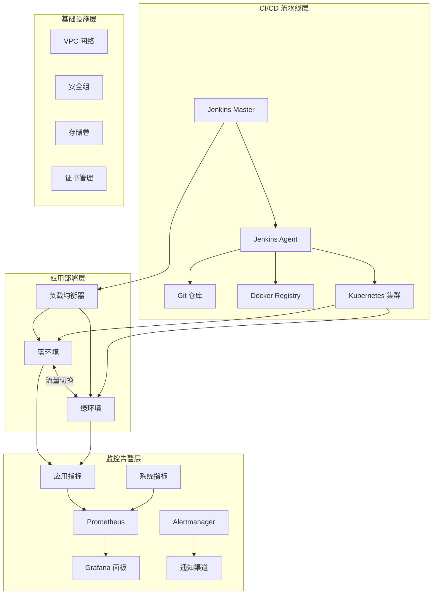
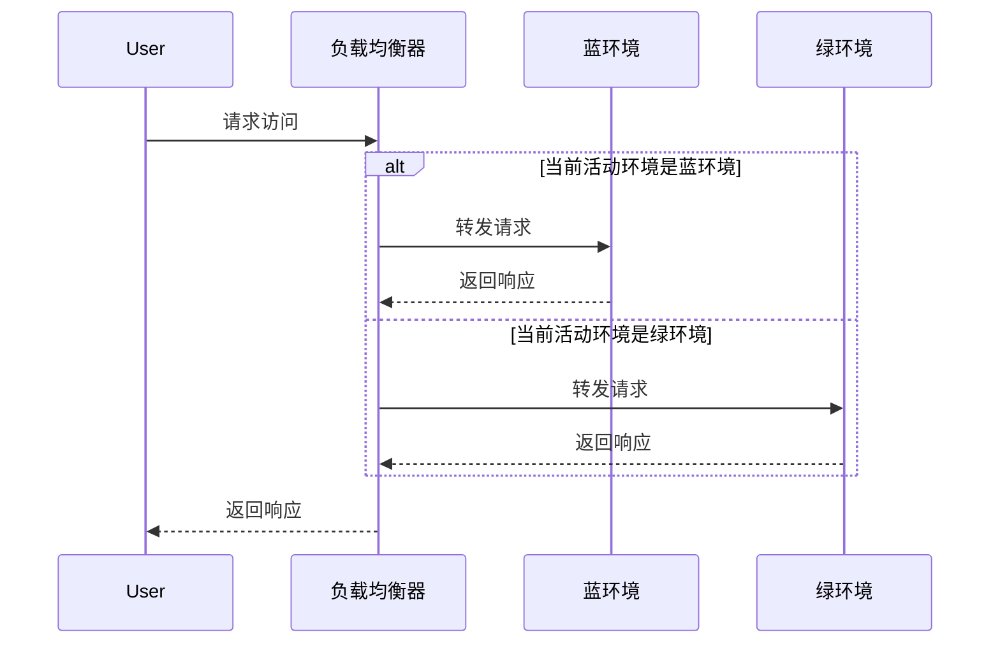

# Jenkins 蓝绿部署实现

这个项目提供了一个基于 Jenkins 的蓝绿部署自动化解决方案，使用 Terraform 和 Shell 脚本实现完整的 CI/CD 流水线。该方案支持零停机部署、自动回滚和流量切换，特别适合生产环境的关键业务系统。

## 架构概览

### 系统架构图



### 核心组件

1. **Jenkins 流水线**
   - 多分支流水线支持
   - 参数化构建
   - 人工审核步骤
   
2. **蓝绿环境**
   - 完全隔离的部署环境
   - 独立的资源组/命名空间
   - 独立的数据库实例
   
3. **流量管理**
   - 基于 Nginx 的流量切换
   - 会话保持支持
   - 灰度发布能力
   
4. **监控告警**
   - 应用性能监控
   - 业务指标收集
   - 多级告警策略

## 蓝绿部署详解

### 基本概念

蓝绿部署是一种应用发布策略，通过同时维护两个相同但独立的生产环境（蓝环境和绿环境）来实现零停机时间部署。在任意时刻，只有一个环境处于活动状态并接收生产流量。

- **蓝环境 (Blue)**: 当前的生产环境，处理真实用户流量
- **绿环境 (Green)**: 新版本的部署环境，用于测试和验证

### 工作流程

1. **准备阶段**
   - 准备新版本的应用镜像
   - 准备数据库迁移脚本
   - 准备配置文件和环境变量

2. **部署阶段**
   - 将新版本部署到非活动环境
   - 执行数据库迁移
   - 运行健康检查

3. **测试阶段**
   - 自动化测试
   - 人工验收测试
   - 性能基准测试

4. **切换阶段**
   - 预热新环境
   - 切换流量到新环境
   - 监控系统稳定性

5. **清理阶段**
   - 保留旧环境一段时间
   - 清理过期的资源
   - 更新文档和记录

### 优势

- **零停机部署**：用户无感知的更新
- **快速回滚**：秒级回退到旧版本
- **安全验证**：新版本完全测试后再切换流量
- **降低风险**：出现问题可立即切换回旧版本

## 项目结构

```
tf-jenkins-bluegreen/
├── Jenkinsfile                # Jenkins 流水线定义
├── scripts/                   # 部署脚本
│   ├── common/                # 公共函数库
│   │   └── utils.sh           # 工具函数
│   ├── deploy/                # 部署相关脚本
│   │   ├── deploy.sh          # 部署主脚本
│   │   ├── prepare.sh         # 环境准备脚本
│   │   └── healthcheck.sh     # 健康检查脚本
│   ├── switch/                # 流量切换相关
│   │   ├── switch.sh          # 流量切换主脚本
│   │   └── validate.sh        # 切换验证脚本
│   └── rollback/              # 回滚相关
│       ├── rollback.sh        # 回滚主脚本
│       └── cleanup.sh         # 清理脚本
│
├── config/                    # 配置文件
│   ├── environments/          # 环境配置
│   │   ├── blue/             # 蓝环境配置
│   │   │   ├── app/          # 应用配置
│   │   │   └── db/           # 数据库配置
│   │   └── green/            # 绿环境配置
│   │       ├── app/          # 应用配置
│   │       └── db/           # 数据库配置
│   └── templates/             # 配置模板
│       ├── nginx/            # Nginx 配置模板
│       └── kubernetes/       # K8s 资源模板
│
├── docs/                      # 文档
│   ├── architecture.md       # 架构设计文档
│   ├── user-guide.md         # 用户指南
│   └── api/                  # API 文档
│
├── tests/                     # 测试代码
│   ├── unit/                 # 单元测试
│   ├── integration/          # 集成测试
│   └── e2e/                  # 端到端测试
│
├── .gitignore                # Git 忽略文件
├── .gitlab-ci.yml            # GitLab CI 配置
└── README.md                 # 项目说明文档
```

### 关键文件说明

1. **Jenkinsfile**
   - 定义完整的 CI/CD 流水线
   - 包含构建、测试、部署阶段
   - 支持参数化构建

2. **scripts/**
   - 模块化的部署脚本
   - 可重用的函数库
   - 完善的错误处理

3. **config/**
   - 环境隔离的配置
   - 模板化的配置文件
   - 敏感信息加密存储

## 实现原理

### 核心设计

#### 1. 环境管理
- 使用 Terraform 管理基础设施
- 每个环境完全独立
- 支持快速创建和销毁环境

#### 2. 流量切换


#### 3. 部署流程
1. 检测当前活动环境
2. 准备目标环境资源
3. 部署新版本到非活动环境
4. 执行自动化测试
5. 切换流量到新环境
6. 验证新环境运行状态
7. 清理旧环境资源

#### 4. 回滚机制
- 记录每次部署的版本
- 支持一键回滚到历史版本
- 保留回滚所需的资源快照

## 快速开始

### 环境要求

#### 1. 系统要求
- Linux/Unix 系统
- 8GB+ 内存
- 50GB+ 磁盘空间

#### 2. 软件依赖
- Jenkins 2.300+
- Docker 20.10+
- Kubernetes 1.20+
- Terraform 1.0+
- kubectl 1.20+
- Helm 3.0+

#### 3. 权限要求
- Kubernetes 集群管理权限
- 容器镜像仓库推送权限
- 云服务商 API 访问权限

### 安装步骤

#### 1. 克隆代码库
```bash
git clone https://github.com/your-org/tf-jenkins-bluegreen.git
cd tf-jenkins-bluegreen
```

#### 2. 配置环境变量
```bash
cp .env.example .env
# 编辑 .env 文件配置相关参数
```

#### 3. 初始化 Terraform
```bash
cd terraform
terraform init
terraform plan
terraform apply
```

#### 4. 配置 Jenkins
1. 安装必要插件：
   - Pipeline
   - Kubernetes
   - Docker Pipeline
   - Git

2. 配置凭据：
   - Git 仓库访问凭据
   - 容器镜像仓库凭据
   - Kubernetes 集群凭据

#### 5. 创建 Jenkins 流水线
1. 新建流水线项目
2. 选择 "Pipeline script from SCM"
3. 配置 Git 仓库地址
4. 设置 Jenkinsfile 路径

### 部署流程

#### 1. 触发部署
```bash
# 手动触发
curl -X POST http://jenkins/job/blue-green-deploy/build \
  --user user:api_token \
  --data-urlencode json='{"parameter": [{"name":"VERSION", "value":"1.0.0"}]}'
```

#### 2. 监控部署进度
```bash
# 查看 Jenkins 构建日志
open http://jenkins/job/blue-green-deploy/lastBuild/console

# 查看 Kubernetes 部署状态
kubectl get pods -n blue
kubectl get pods -n green
```

#### 3. 验证部署
```bash
# 检查服务端点
kubectl get svc -n blue
kubectl get svc -n green

# 访问健康检查
curl http://service-blue.example.com/health
curl http://service-green.example.com/health
```

### 回滚操作

#### 1. 通过 Jenkins 回滚
1. 打开 Jenkins 控制台
2. 选择对应的构建
3. 点击 "Rollback" 按钮

#### 2. 命令行回滚
```bash
./scripts/rollback/rollback.sh --version=1.0.0
```

#### 3. 紧急回滚
```bash
# 直接切换回上一个版本
./scripts/switch/switch.sh --from=green --to=blue
```

## 高级配置

### 1. 环境配置

#### 1.1 应用配置
```yaml
# config/environments/blue/app/app-config.yaml
app:
  name: myapp-blue
  replicaCount: 3
  image:
    repository: my-registry.com/myapp
    tag: v1.0.0
    pullPolicy: IfNotPresent
  
  resources:
    limits:
      cpu: 1000m
      memory: 1Gi
    requests:
      cpu: 500m
      memory: 512Mi
  
  autoscaling:
    enabled: true
    minReplicas: 2
    maxReplicas: 10
    targetCPUUtilizationPercentage: 80
    targetMemoryUtilizationPercentage: 80
```

#### 1.2 数据库配置
```yaml
# config/environments/blue/db/db-config.yaml
database:
  host: db-blue
  port: 5432
  name: myapp_prod
  user: admin
  
  # 连接池配置
  pool:
    maxOpenConns: 100
    maxIdleConns: 20
    connMaxLifetime: 1h
```

### 2. 网络配置

#### 2.1 Ingress 配置
```yaml
# config/templates/kubernetes/ingress.yaml
apiVersion: networking.k8s.io/v1
kind: Ingress
metadata:
  name: {{ .Values.app.name }}-ingress
  annotations:
    nginx.ingress.kubernetes.io/rewrite-target: /
    nginx.ingress.kubernetes.io/ssl-redirect: "true"
    nginx.ingress.kubernetes.io/force-ssl-redirect: "true"
    nginx.ingress.kubernetes.io/proxy-body-size: 50m
    
spec:
  ingressClassName: nginx
  tls:
  - hosts:
    - {{ .Values.ingress.host }}
    secretName: {{ .Values.ingress.tlsSecret }}
  rules:
  - host: {{ .Values.ingress.host }}
    http:
      paths:
      - path: /
        pathType: Prefix
        backend:
          service:
            name: {{ .Values.app.name }}
            port:
              number: {{ .Values.service.port }}
```

### 3. 监控告警

#### 3.1 Prometheus 监控规则
```yaml
# config/monitoring/prometheus-rules.yaml
groups:
- name: myapp.rules
  rules:
  - alert: HighErrorRate
    expr: rate(http_requests_total{status=~"5.."}[5m]) / rate(http_requests_total[5m]) > 0.1
    for: 10m
    labels:
      severity: critical
    annotations:
      summary: "High error rate on {{ $labels.instance }}"
      description: "{{ $labels.instance }} has a high error rate: {{ $value }}%"
```

#### 3.2 Grafana 仪表板
```json
// config/monitoring/grafana-dashboard.json
{
  "annotations": {
    "list": [
      {
        "builtIn": 1,
        "datasource": "-- Grafana --",
        "enable": true,
        "hide": true,
        "iconColor": "rgba(0, 211, 255, 1)",
        "name": "Annotations & Alerts",
        "type": "dashboard"
      }
    ]
  },
  "editable": true,
  "gnetId": null,
  "graphTooltip": 0,
  "id": null,
  "links": [],
  "panels": [
    {
      "datasource": null,
      "description": "HTTP 请求率",
      "fieldConfig": {
        "defaults": {
          "color": {
            "mode": "palette-classic"
          },
          "thresholds": {
            "mode": "absolute",
            "steps": [
              {
                "color": "green",
                "value": null
              },
              {
                "color": "red",
                "value": 80
              }
            ]
          },
          "unit": "reqps"
        },
        "overrides": []
      },
      "gridPos": {
        "h": 8,
        "w": 12,
        "x": 0,
        "y": 0
      },
      "id": 2,
      "options": {
        "legend": {
          "calcs": [],
          "displayMode": "list",
          "placement": "bottom"
        },
        "tooltip": {
          "mode": "single"
        }
      },
      "targets": [
        {
          "expr": "sum(rate(http_requests_total[5m])) by (status_code)",
          "legendFormat": "{{status_code}}",
          "refId": "A"
        }
      ],
      "title": "HTTP 请求率",
      "type": "timeseries"
    }
  ],
  "schemaVersion": 30,
  "style": "dark",
  "tags": ["myapp"],
  "templating": {
    "list": [
      {
        "current": {
          "selected": false,
          "text": "Prometheus",
          "value": "Prometheus"
        },
        "name": "DS_PROMETHEUS",
        "options": [],
        "query": "prometheus",
        "refresh": 1,
        "regex": "(prometheus|Prometheus)",
        "type": "datasource"
      }
    ]
  },
  "time": {
    "from": "now-6h",
    "to": "now"
  },
  "timepicker": {
    "refresh_intervals": ["5s", "10s", "30s", "1m", "5m", "15m", "30m", "1h", "2h", "1d"],
    "time_options": ["5m", "15m", "1h", "6h", "12h", "24h", "2d", "7d", "30d"]
  },
  "timezone": "browser",
  "title": "MyApp 监控看板",
  "version": 1
}
```

### 4. 安全配置

#### 4.1 网络策略
```yaml
# config/security/network-policy.yaml
apiVersion: networking.k8s.io/v1
kind: NetworkPolicy
metadata:
  name: myapp-network-policy
  namespace: {{ .Release.Namespace }}
spec:
  podSelector:
    matchLabels:
      app: {{ .Values.app.name }}
  policyTypes:
  - Ingress
  - Egress
  ingress:
  - from:
    - namespaceSelector:
        matchLabels:
          name: monitoring
    ports:
    - protocol: TCP
      port: 8080
  egress:
  - to:
    - namespaceSelector:
        matchLabels:
          name: database
    ports:
    - protocol: TCP
      port: 5432
```

## 最佳实践

### 1. 部署策略

#### 1.1 蓝绿部署
- 维护两个完全独立的环境
- 通过负载均衡器切换流量
- 支持快速回滚

#### 1.2 金丝雀发布
- 逐步将流量从旧版本迁移到新版本
- 基于请求头或 Cookie 的路由
- 实时监控关键指标

### 2. 监控告警

#### 2.1 关键指标
- 应用性能指标（QPS、延迟、错误率）
- 系统资源使用率（CPU、内存、磁盘、网络）
- 业务指标（订单量、支付成功率等）

#### 2.2 告警策略
- 多级告警（警告、严重、灾难）
- 基于持续时间的告警
- 告警聚合和抑制

### 3. 安全实践

#### 3.1 访问控制
- 基于角色的访问控制（RBAC）
- 最小权限原则
- 定期轮换凭据

#### 3.2 数据保护
- 传输加密（TLS）
- 静态数据加密
- 敏感信息管理（Secrets Manager）

## 故障排除

### 1. 常见问题

#### 1.1 部署失败
```bash
# 查看部署状态
kubectl get pods -n <namespace>

# 查看事件
kubectl get events --sort-by='.metadata.creationTimestamp'

# 查看日志
kubectl logs -f <pod-name> -n <namespace>
```

#### 1.2 流量切换问题
```bash
# 检查 Ingress 配置
kubectl get ingress -n <namespace>

# 检查服务端点
kubectl get endpoints -n <namespace>

# 测试服务访问
curl -v http://service.namespace.svc.cluster.local:8080/health
```

### 2. 日志收集

#### 2.1 容器日志
```bash
# 查看容器日志
kubectl logs -f <pod-name> -n <namespace> -c <container-name>

# 查看前一天的日志
kubectl logs --since=24h <pod-name> -n <namespace>
```

#### 2.2 日志聚合
- 使用 EFK 或 Loki 收集日志
- 配置日志保留策略
- 设置日志告警规则

## 性能优化

### 1. 资源分配

#### 1.1 请求和限制
```yaml
resources:
  requests:
    cpu: "500m"
    memory: "512Mi"
  limits:
    cpu: "1000m"
    memory: "1Gi"
```

#### 1.2 水平扩缩容
```yaml
autoscaling:
  enabled: true
  minReplicas: 2
  maxReplicas: 10
  targetCPUUtilizationPercentage: 70
  targetMemoryUtilizationPercentage: 80
```

### 2. 应用优化

#### 2.1 连接池配置
```yaml
database:
  pool:
    maxOpenConns: 100
    maxIdleConns: 20
    connMaxLifetime: 1h
```

#### 2.2 缓存策略
- 实现多级缓存（本地缓存、分布式缓存）
- 设置合理的过期时间
- 使用缓存预热

## 贡献指南

### 1. 开发流程

#### 1.1 分支策略
- `main`: 生产环境代码
- `staging`: 预发布环境代码
- `develop`: 开发分支
- `feature/*`: 功能开发分支
- `hotfix/*`: 紧急修复分支

#### 1.2 提交规范
```
<type>(<scope>): <subject>

[optional body]

[optional footer]
```

#### 1.3 代码审查
- 每个 PR 至少需要一个代码审查
- 确保所有测试通过
- 更新相关文档

## 许可证

本项目采用 [MIT 许可证](LICENSE)

## 支持

- 文档: [查看文档](https://example.com/docs)
- 问题追踪: [GitHub Issues](https://github.com/your-org/tf-jenkins-bluegreen/issues)
- 讨论: [GitHub Discussions](https://github.com/your-org/tf-jenkins-bluegreen/discussions)
- 邮件: support@example.com
