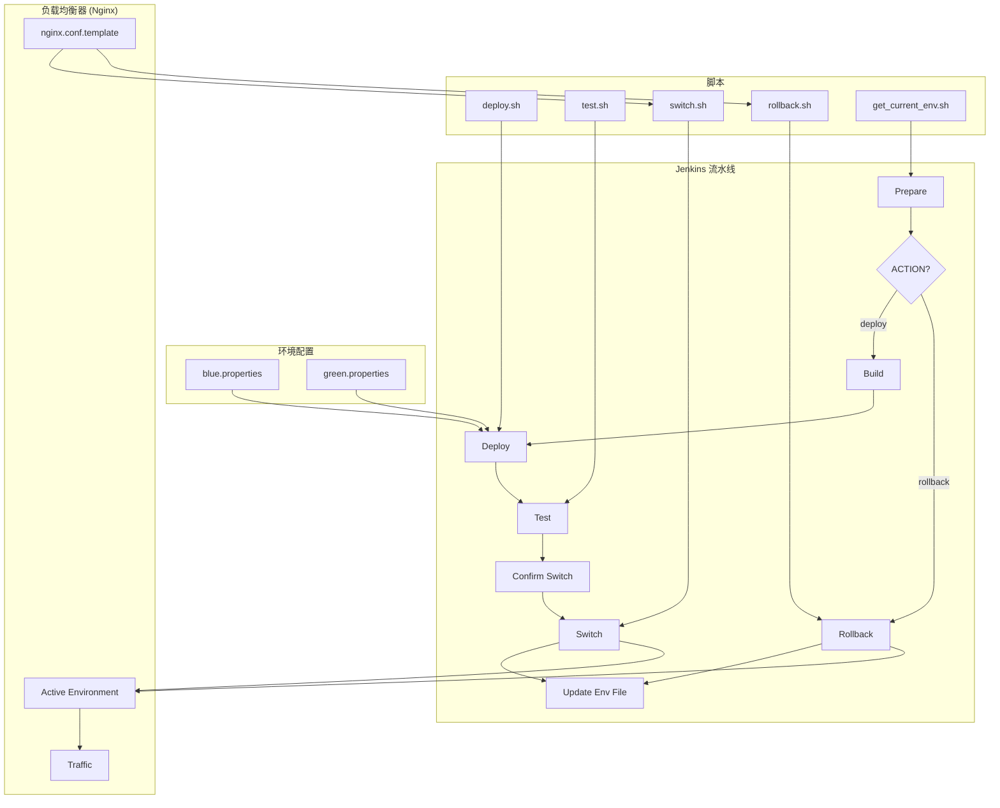

# Jenkins 蓝绿部署实现

这个项目提供了一个简单的 Jenkins 蓝绿部署实现方案，使用 Jenkinsfile 和脚本来管理蓝绿环境的切换。

## 架构图



## 什么是蓝绿部署？

蓝绿部署是一种应用发布策略，通过同时维护两个相同但独立的生产环境（蓝环境和绿环境）来实现零停机时间部署。在任意时刻，只有一个环境处于活动状态并接收生产流量。

- **蓝环境**：当前的生产环境
- **绿环境**：新版本的部署环境

部署新版本时，将新版本部署到非活动环境，测试通过后，将流量从当前活动环境切换到新环境。这样可以实现快速回滚（只需将流量切回原环境）和零停机时间部署。

## 项目结构

```
tf-jenkins-bluegreen/
├── Jenkinsfile                # Jenkins 流水线定义
├── scripts/
│   ├── deploy.sh              # 部署脚本
│   ├── switch.sh              # 环境切换脚本
│   └── rollback.sh            # 回滚脚本
├── config/
│   ├── blue.properties        # 蓝环境配置
│   └── green.properties       # 绿环境配置
└── README.md                  # 项目说明文档
```

## 实现原理

本实现采用以下简单策略：

1. 维护两个独立的部署环境（蓝和绿）
2. 使用 Nginx 或其他负载均衡器作为流量控制器
3. Jenkins 流水线负责构建、部署和环境切换
4. 提供简单的回滚机制

## 使用方法

### 前提条件

1. 已安装 Jenkins 服务器
2. Jenkins 已安装必要的插件：Pipeline, Git, etc.
3. 已配置两个部署环境（可以是服务器、容器或 Kubernetes 命名空间）

### 配置 Jenkins 流水线

1. 在 Jenkins 中创建新的流水线项目
2. 配置 Git 仓库，指向包含本项目代码的仓库
3. 配置流水线使用项目中的 Jenkinsfile

### 执行部署

1. 触发 Jenkins 流水线构建
2. 流水线将自动执行以下步骤：
   - 构建应用
   - 确定当前活动环境（蓝或绿）
   - 将新版本部署到非活动环境
   - 运行测试
   - 提示确认是否切换流量
   - 执行环境切换
   - 监控新环境

### 回滚

如果新版本出现问题，可以通过以下方式回滚：

1. 在 Jenkins 流水线中选择"回滚"选项
2. 或手动执行 `rollback.sh` 脚本

## 自定义配置

修改 `config` 目录中的配置文件，可以自定义每个环境的具体参数：

- 部署目标（服务器、容器、命名空间等）
- 环境特定的配置参数
- 健康检查 URL
- 其他环境特定设置
