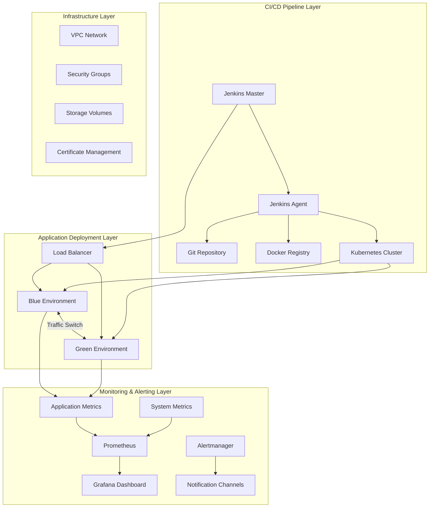
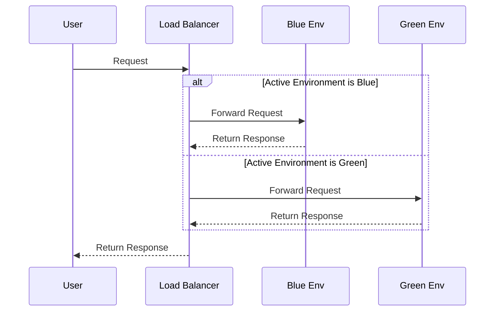

# Jenkins Blue/Green Deployment Implementation

This project provides a robust, production-ready Blue/Green deployment automation solution using Jenkins, Terraform, and Shell scripts. It implements a complete CI/CD pipeline supporting zero-downtime deployments, automated rollback, and traffic switching, specifically designed for mission-critical production environments.

## Architecture Overview

### System Architecture



### Core Components

1. **Jenkins Pipeline**
   - Multi-branch pipeline support
   - Parameterized builds
   - Manual approval steps
   
2. **Blue/Green Environments**
   - Fully isolated deployment environments
   - Independent resource groups/namespaces
   - Dedicated database instances
   
3. **Traffic Management**
   - Nginx-based traffic switching
   - Session persistence support
   - Canary deployment capabilities
   
4. **Monitoring & Alerting**
   - Application performance monitoring
   - Business metrics collection
   - Multi-level alerting policies

## Blue/Green Deployment Explained

### Core Concepts

Blue/Green deployment is an application release strategy that maintains two identical but separate production environments (blue and green). At any given time, only one environment is active and receiving production traffic, enabling zero-downtime deployments.

- **Blue Environment**: The current production environment handling live traffic
- **Green Environment**: The staging environment for new version deployment and testing

### Workflow

1. **Preparation Phase**
   - Prepare new application container images
   - Prepare database migration scripts
   - Configure environment variables and settings

2. **Deployment Phase**
   - Deploy new version to inactive environment
   - Execute database migrations
   - Run health checks

3. **Testing Phase**
   - Execute automated tests
   - Perform manual verification
   - Run performance benchmarks

4. **Switch Phase**
   - Warm up the new environment
   - Switch traffic to the new environment
   - Monitor system stability

5. **Cleanup Phase**
   - Retain old environment for a grace period
   - Clean up deprecated resources
   - Update documentation and records

### Key Benefits

- **Zero Downtime Deployments**: Updates are completely transparent to users
- **Instant Rollback**: Revert to previous version in seconds
- **Safe Validation**: Full testing before traffic switch
- **Risk Mitigation**: Immediate fallback to previous version if issues arise

## Project Structure

```
tf-jenkins-bluegreen/
├── Jenkinsfile                # Jenkins pipeline definition
├── scripts/                   # Deployment scripts
│   ├── common/                # Shared libraries
│   │   └── utils.sh           # Utility functions
│   ├── deploy/                # Deployment scripts
│   │   ├── deploy.sh          # Main deployment script
│   │   ├── prepare.sh         # Environment preparation
│   │   └── healthcheck.sh     # Health check utilities
│   ├── switch/                # Traffic switching
│   │   ├── switch.sh          # Main switch script
│   │   └── validate.sh        # Switch validation
│   └── rollback/              # Rollback operations
│       ├── rollback.sh        # Main rollback script
│       └── cleanup.sh         # Resource cleanup
│
├── config/                    # Configuration files
│   ├── environments/          # Environment configurations
│   │   ├── blue/             # Blue environment
│   │   │   ├── app/          # App configuration
│   │   │   └── db/           # Database configuration
│   │   └── green/            # Green environment
│   │       ├── app/          # App configuration
│   │       └── db/           # Database configuration
│   └── templates/             # Configuration templates
│       ├── nginx/            # Nginx templates
│       └── kubernetes/       # K8s manifests
│
├── docs/                      # Documentation
│   ├── architecture.md       # Architecture documentation
│   ├── user-guide.md         # User guide
│   └── api/                  # API documentation
│
├── tests/                     # Test suites
│   ├── unit/                 # Unit tests
│   ├── integration/          # Integration tests
│   └── e2e/                  # End-to-end tests
│
├── .gitignore                # Git ignore rules
├── .gitlab-ci.yml            # GitLab CI configuration
└── README.md                 # Project documentation
```

### Key Files

1. **Jenkinsfile**
   - Defines the complete CI/CD pipeline
   - Includes build, test, and deploy stages
   - Supports parameterized builds

2. **scripts/**
   - Modular deployment scripts
   - Reusable function library
   - Comprehensive error handling

3. **config/**
   - Environment-specific configurations
   - Template-based configuration files
   - Secure secret management

## Implementation Details

### Core Design

#### 1. Environment Management
- Uses Terraform for infrastructure provisioning
- Each environment is completely isolated
- Supports rapid environment creation and teardown

#### 2. Traffic Switching


#### 3. Deployment Process
1. Detect current active environment
2. Prepare target environment resources
3. Deploy new version to inactive environment
4. Execute automated tests
5. Switch traffic to new environment
6. Verify new environment operation
7. Clean up old environment resources

#### 4. Rollback Mechanism
- Tracks deployment history
- Supports one-click rollback to any previous version
- Maintains resource snapshots for rollback

## Getting Started

### System Requirements

#### 1. Hardware Requirements
- Linux/Unix system
- 8GB+ RAM
- 50GB+ disk space

#### 2. Software Dependencies
- Jenkins 2.300+
- Docker 20.10+
- Kubernetes 1.20+
- Terraform 1.0+
- kubectl 1.20+
- Helm 3.0+

#### 3. Access Requirements
- Kubernetes cluster admin access
- Container registry push access
- Cloud provider API access

### Installation

#### 1. Clone Repository
```bash
git clone https://github.com/your-org/tf-jenkins-bluegreen.git
cd tf-jenkins-bluegreen
```

#### 2. Configure Environment
```bash
cp .env.example .env
# Edit .env with your configuration
```

#### 3. Initialize Terraform
```bash
cd terraform
terraform init
terraform plan
terraform apply
```

#### 4. Configure Jenkins
1. Install required plugins:
   - Pipeline
   - Kubernetes
   - Docker Pipeline
   - Git

2. Configure credentials:
   - Git repository access
   - Container registry
   - Kubernetes cluster

#### 5. Create Pipeline
1. Create new pipeline job
2. Select "Pipeline script from SCM"
3. Configure Git repository
4. Set Jenkinsfile path

### Deployment Process

#### 1. Trigger Deployment
```bash
# Manual trigger
curl -X POST http://jenkins/job/blue-green-deploy/build \
  --user user:api_token \
  --data-urlencode json='{"parameter": [{"name":"VERSION", "value":"1.0.0"}]}'
```

#### 2. Monitor Progress
```bash
# View Jenkins build logs
open http://jenkins/job/blue-green-deploy/lastBuild/console

# Check Kubernetes status
kubectl get pods -n blue
kubectl get pods -n green
```

#### 3. Verify Deployment
```bash
# Check service endpoints
kubectl get svc -n blue
kubectl get svc -n green

# Test health checks
curl http://service-blue.example.com/health
curl http://service-green.example.com/health
```

### Rollback Procedure

#### 1. Via Jenkins UI
1. Open Jenkins console
2. Select target build
3. Click "Rollback" button

#### 2. Command Line
```bash
./scripts/rollback/rollback.sh --version=1.0.0
```

#### 3. Emergency Rollback
```bash
# Direct switch to previous version
./scripts/switch/switch.sh --from=green --to=blue
```

## Advanced Configuration

### 1. Environment Configuration

#### 1.1 Application Settings
```yaml
# config/environments/blue/app/app-config.yaml
app:
  name: myapp-blue
  replicaCount: 3
  image:
    repository: my-registry.com/myapp
    tag: v1.0.0
    pullPolicy: IfNotPresent
  
  resources:
    limits:
      cpu: 1000m
      memory: 1Gi
    requests:
      cpu: 500m
      memory: 512Mi
  
  autoscaling:
    enabled: true
    minReplicas: 2
    maxReplicas: 10
    targetCPUUtilizationPercentage: 80
    targetMemoryUtilizationPercentage: 80
```

#### 1.2 Database Configuration
```yaml
# config/environments/blue/db/db-config.yaml
database:
  host: db-blue
  port: 5432
  name: myapp_prod
  user: admin
  
  # Connection pool settings
  pool:
    maxOpenConns: 100
    maxIdleConns: 20
    connMaxLifetime: 1h
```

### 2. Network Configuration

#### 2.1 Ingress Configuration
```yaml
# config/templates/kubernetes/ingress.yaml
apiVersion: networking.k8s.io/v1
kind: Ingress
metadata:
  name: {{ .Values.app.name }}-ingress
  annotations:
    nginx.ingress.kubernetes.io/rewrite-target: /
    nginx.ingress.kubernetes.io/ssl-redirect: "true"
    nginx.ingress.kubernetes.io/force-ssl-redirect: "true"
    nginx.ingress.kubernetes.io/proxy-body-size: 50m
    
spec:
  ingressClassName: nginx
  tls:
  - hosts:
    - {{ .Values.ingress.host }}
    secretName: {{ .Values.ingress.tlsSecret }}
  rules:
  - host: {{ .Values.ingress.host }}
    http:
      paths:
      - path: /
        pathType: Prefix
        backend:
          service:
            name: {{ .Values.app.name }}
            port:
              number: {{ .Values.service.port }}
```

### 3. Monitoring & Alerting

#### 3.1 Prometheus Alert Rules
```yaml
# config/monitoring/prometheus-rules.yaml
groups:
- name: myapp.rules
  rules:
  - alert: HighErrorRate
    expr: rate(http_requests_total{status=~"5.."}[5m]) / rate(http_requests_total[5m]) > 0.1
    for: 10m
    labels:
      severity: critical
    annotations:
      summary: "High error rate on {{ $labels.instance }}"
      description: "{{ $labels.instance }} has a high error rate: {{ $value }}%"
```

#### 3.2 Grafana Dashboard
```json
// config/monitoring/grafana-dashboard.json
{
  "annotations": {
    "list": [
      {
        "builtIn": 1,
        "datasource": "-- Grafana --",
        "enable": true,
        "hide": true,
        "iconColor": "rgba(0, 211, 255, 1)",
        "name": "Annotations & Alerts",
        "type": "dashboard"
      }
    ]
  },
  "editable": true,
  "gnetId": null,
  "graphTooltip": 0,
  "id": null,
  "links": [],
  "panels": [
    {
      "datasource": null,
      "description": "HTTP Request Rate",
      "fieldConfig": {
        "defaults": {
          "color": {
            "mode": "palette-classic"
          },
          "thresholds": {
            "mode": "absolute",
            "steps": [
              {
                "color": "green",
                "value": null
              },
              {
                "color": "red",
                "value": 80
              }
            ]
          },
          "unit": "reqps"
        },
        "overrides": []
      },
      "gridPos": {
        "h": 8,
        "w": 12,
        "x": 0,
        "y": 0
      },
      "id": 2,
      "options": {
        "legend": {
          "calcs": [],
          "displayMode": "list",
          "placement": "bottom"
        },
        "tooltip": {
          "mode": "single"
        }
      },
      "targets": [
        {
          "expr": "sum(rate(http_requests_total[5m])) by (status_code)",
          "legendFormat": "{{status_code}}",
          "refId": "A"
        }
      ],
      "title": "HTTP Request Rate",
      "type": "timeseries"
    }
  ],
  "schemaVersion": 30,
  "style": "dark",
  "tags": ["myapp"],
  "templating": {
    "list": [
      {
        "current": {
          "selected": false,
          "text": "Prometheus",
          "value": "Prometheus"
        },
        "name": "DS_PROMETHEUS",
        "options": [],
        "query": "prometheus",
        "refresh": 1,
        "regex": "(prometheus|Prometheus)",
        "type": "datasource"
      }
    ]
  },
  "time": {
    "from": "now-6h",
    "to": "now"
  },
  "timepicker": {
    "refresh_intervals": ["5s", "10s", "30s", "1m", "5m", "15m", "30m", "1h", "2h", "1d"],
    "time_options": ["5m", "15m", "1h", "6h", "12h", "24h", "2d", "7d", "30d"]
  },
  "timezone": "browser",
  "title": "MyApp Monitoring Dashboard",
  "version": 1
}
```

### 4. Security Configuration

#### 4.1 Network Policies
```yaml
# config/security/network-policy.yaml
apiVersion: networking.k8s.io/v1
kind: NetworkPolicy
metadata:
  name: myapp-network-policy
  namespace: {{ .Release.Namespace }}
spec:
  podSelector:
    matchLabels:
      app: {{ .Values.app.name }}
  policyTypes:
  - Ingress
  - Egress
  ingress:
  - from:
    - namespaceSelector:
        matchLabels:
          name: monitoring
    ports:
    - protocol: TCP
      port: 8080
  egress:
  - to:
    - namespaceSelector:
        matchLabels:
          name: database
    ports:
    - protocol: TCP
      port: 5432
```

## Best Practices

### 1. Deployment Strategies

#### 1.1 Blue/Green Deployment
- Maintain two fully independent environments
- Switch traffic using load balancer
- Support instant rollback

#### 1.2 Canary Releases
- Gradually shift traffic from old to new version
- Route based on headers or cookies
- Monitor key metrics in real-time

### 2. Monitoring & Alerting

#### 2.1 Key Metrics
- Application performance (QPS, latency, error rate)
- System resource usage (CPU, memory, disk, network)
- Business metrics (order volume, payment success rate, etc.)

#### 2.2 Alerting Strategy
- Multi-level alerts (warning, critical, disaster)
- Duration-based alerting
- Alert aggregation and inhibition

### 3. Security Practices

#### 3.1 Access Control
- Role-based access control (RBAC)
- Principle of least privilege
- Regular credential rotation

#### 3.2 Data Protection
- Transport encryption (TLS)
- Data encryption at rest
- Secrets management (Vault, AWS Secrets Manager)

## Troubleshooting

### 1. Common Issues

#### 1.1 Deployment Failures
```bash
# Check deployment status
kubectl get pods -n <namespace>

# View events
kubectl get events --sort-by='.metadata.creationTimestamp'

# Check logs
kubectl logs -f <pod-name> -n <namespace>
```

#### 1.2 Traffic Switching Issues
```bash
# Check Ingress configuration
kubectl get ingress -n <namespace>

# Check service endpoints
kubectl get endpoints -n <namespace>

# Test service access
curl -v http://service.namespace.svc.cluster.local:8080/health
```

### 2. Log Collection

#### 2.1 Container Logs
```bash
# View container logs
kubectl logs -f <pod-name> -n <namespace> -c <container-name>

# View logs from last 24 hours
kubectl logs --since=24h <pod-name> -n <namespace>
```

#### 2.2 Log Aggregation
- Use EFK or Loki stack
- Configure log retention policies
- Set up log-based alerts

## Performance Optimization

### 1. Resource Allocation

#### 1.1 Requests and Limits
```yaml
resources:
  requests:
    cpu: "500m"
    memory: "512Mi"
  limits:
    cpu: "1000m"
    memory: "1Gi"
```

#### 1.2 Horizontal Pod Autoscaling
```yaml
autoscaling:
  enabled: true
  minReplicas: 2
  maxReplicas: 10
  targetCPUUtilizationPercentage: 70
  targetMemoryUtilizationPercentage: 80
```

### 2. Application Optimization

#### 2.1 Connection Pooling
```yaml
database:
  pool:
    maxOpenConns: 100
    maxIdleConns: 20
    connMaxLifetime: 1h
```

#### 2.2 Caching Strategy
- Implement multi-level caching
- Set appropriate TTLs
- Use cache warming

## Contributing

### 1. Development Workflow

#### 1.1 Branching Strategy
- `main`: Production code
- `staging`: Pre-production code
- `develop`: Development branch
- `feature/*`: Feature branches
- `hotfix/*`: Hotfix branches

#### 1.2 Commit Message Format
```
<type>(<scope>): <subject>

[optional body]

[optional footer]
```

#### 1.3 Code Review
- At least one code review required per PR
- All tests must pass
- Update relevant documentation

## License

This project is licensed under the [MIT License](LICENSE)

## Support

- Documentation: [View Docs](https://example.com/docs)
- Issue Tracker: [GitHub Issues](https://github.com/your-org/tf-jenkins-bluegreen/issues)
- Discussions: [GitHub Discussions](https://github.com/your-org/tf-jenkins-bluegreen/discussions)
- Email: support@example.com
