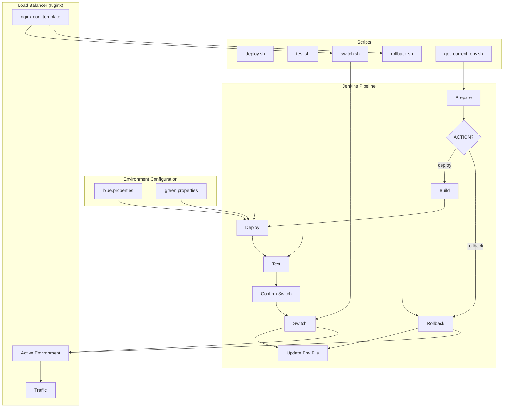

# Jenkins Blue/Green Deployment Implementation

This project provides a simple implementation of Blue/Green deployment using Jenkins, with Jenkinsfile and scripts to manage the switching between blue and green environments.

## Architecture Diagram



## What is Blue/Green Deployment?

Blue/Green deployment is an application release strategy that maintains two identical but separate production environments (blue and green). At any given time, only one environment is active and receiving production traffic. This approach enables zero-downtime deployments.

## Project Structure

```
tf-jenkins-bluegreen/
├── Jenkinsfile              # Jenkins pipeline definition
├── scripts/
│   ├── deploy.sh            # Script to deploy to target environment
│   ├── test.sh              # Script to test the target environment
│   ├── switch.sh            # Script to switch traffic between environments
│   ├── rollback.sh          # Script to rollback to previous environment
│   └── get_current_env.sh   # Script to determine current active environment
├── config/
│   ├── blue.properties      # Blue environment configuration
│   ├── green.properties     # Green environment configuration
│   └── nginx.conf.template  # Nginx configuration template
└── README.md                # Project documentation
```

## How It Works

1. **Environment Detection**: The pipeline automatically detects which environment (blue or green) is currently active.
2. **Deployment**: The new version is deployed to the inactive environment.
3. **Testing**: Automated tests are run against the newly deployed environment.
4. **Traffic Switching**: After successful testing and manual confirmation, traffic is switched to the new environment.
5. **Rollback**: If needed, traffic can be quickly switched back to the previous environment.

## Setup Instructions

### Prerequisites

1. Jenkins server with Pipeline plugin installed
2. Two separate environments (blue and green) for your application
3. Nginx or similar load balancer for traffic routing
4. SSH access to deployment servers

### Jenkins Pipeline Configuration

1. Create a new Pipeline job in Jenkins
2. Configure the job to use the Jenkinsfile from this repository
3. Configure necessary credentials in Jenkins for SSH access

### Environment Configuration

1. Modify the configuration files in the `config` directory to match your environment:
   - `blue.properties`: Configuration for the blue environment
   - `green.properties`: Configuration for the green environment
   - `nginx.conf.template`: Template for your Nginx configuration

2. Update the scripts in the `scripts` directory to match your deployment process.

## Usage

### Deploying a New Version

1. Trigger the Jenkins pipeline with the parameter `ACTION=deploy` and `VERSION=your-version-number`
2. The pipeline will automatically:
   - Determine the current active environment
   - Deploy to the inactive environment
   - Run tests
   - Prompt for confirmation before switching traffic
   - Switch traffic to the new environment

### Rolling Back

1. Trigger the Jenkins pipeline with the parameter `ACTION=rollback`
2. The pipeline will automatically switch traffic back to the previous environment

## Customization

You can customize this implementation by:

1. Modifying the Jenkinsfile to add additional stages
2. Updating the scripts to match your specific deployment process
3. Adding additional test types in the test.sh script
4. Integrating with notification systems (Slack, email, etc.)

## Notes

- This implementation assumes a simple web application deployment
- For more complex applications, consider adding database migration steps
- The implementation can be extended to support containerized environments
- Consider adding monitoring and automated verification after switching
