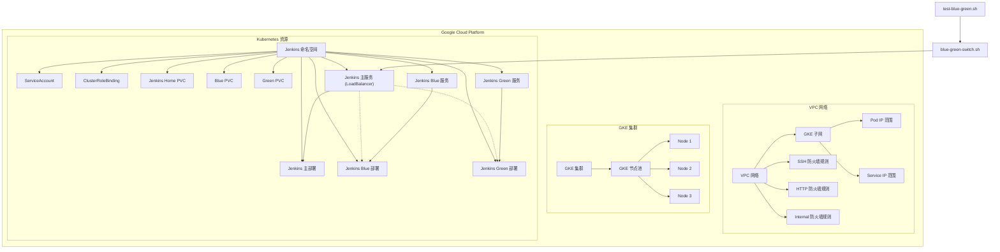

# tf-jenkins-on-gke

使用 Terraform 在 Google Kubernetes Engine (GKE) 上部署 Jenkins，并实现蓝绿发布功能。

## 架构图



## 项目结构

```
tf-jenkins-on-gke/
├── main.tf                  # 主 Terraform 配置文件
├── variables.tf             # 变量定义文件
├── modules/                 # 模块目录
│   ├── network/              # 网络模块
│   │   ├── main.tf          # 网络配置
│   │   ├── variables.tf     # 网络模块变量
│   │   └── outputs.tf       # 网络模块输出
│   ├── gke/                 # GKE 集群模块
│   │   ├── main.tf          # GKE 集群配置
│   │   ├── variables.tf     # GKE 模块变量
│   │   └── outputs.tf       # GKE 模块输出
│   └── jenkins/             # Jenkins 模块
│       ├── main.tf          # Jenkins 基本配置
│       ├── variables.tf     # Jenkins 模块变量
│       ├── outputs.tf       # Jenkins 模块输出
│       └── blue-green-deployment.tf # 蓝绿部署配置
├── environments/            # 环境特定配置
│   ├── dev/                 # 开发环境
│   └── prod/                # 生产环境
└── scripts/                 # 脚本目录
    ├── blue-green-switch.sh # 蓝绿发布切换脚本
    └── test-blue-green.sh   # 蓝绿发布测试脚本
```

## 前提条件

- [Terraform](https://www.terraform.io/downloads.html) >= 0.14
- [Google Cloud SDK](https://cloud.google.com/sdk/docs/install)
- [kubectl](https://kubernetes.io/docs/tasks/tools/install-kubectl/)
- 有效的 Google Cloud 项目和相应的权限

## 配置

1. 创建 `terraform.tfvars` 文件并配置必要的变量：

```hcl
# GCP 项目配置
project_id = "your-gcp-project-id"
region     = "asia-east1"
zone       = "asia-east1-a"

# 网络配置
network_name         = "jenkins-network"      # VPC 网络名称
subnet_name          = "jenkins-subnet"       # 子网名称
subnet_ip_cidr_range = "10.0.0.0/20"          # 子网 IP CIDR 范围
ip_range_pods_name   = "ip-range-pods"        # Pod IP 范围名称
ip_range_pods_cidr   = "10.16.0.0/16"         # Pod IP CIDR 范围
ip_range_services_name = "ip-range-services"  # 服务 IP 范围名称
ip_range_services_cidr = "10.20.0.0/16"       # 服务 IP CIDR 范围

# GKE 集群配置
cluster_name = "jenkins-cluster"
node_count   = 3
machine_type = "e2-standard-2"

# Jenkins 配置
jenkins_namespace = "jenkins"
```

## 使用方法

### 部署基础设施

1. 初始化 Terraform：

```bash
terraform init
```

2. 查看部署计划：

```bash
terraform plan
```

3. 应用部署：

```bash
terraform apply
```

4. 确认部署后，Terraform 将输出 Jenkins 的 URL 和 IP 地址。

### 蓝绿发布

项目包含了蓝绿发布的功能，可以通过以下步骤进行测试：

1. 确保脚本具有执行权限：

```bash
chmod +x scripts/blue-green-switch.sh scripts/test-blue-green.sh
```

2. 测试蓝绿发布功能：

```bash
./scripts/test-blue-green.sh jenkins
```

该脚本将执行以下操作：
- 检查 Jenkins 服务和蓝绿部署是否存在
- 确定当前服务指向的环境（蓝色或绿色）
- 切换到另一个环境
- 验证切换是否成功
- 测试服务是否可访问
- 切换回原始环境

### 手动切换蓝绿环境

如果需要手动切换蓝绿环境，可以使用以下命令：

```bash
./scripts/blue-green-switch.sh jenkins blue  # 切换到蓝色环境
```

或

```bash
./scripts/blue-green-switch.sh jenkins green  # 切换到绿色环境
```

## 清理资源

要删除所有创建的资源，请运行：

```bash
terraform destroy
```

## 注意事项

- 首次访问 Jenkins 时，需要获取初始管理员密码。可以通过以下命令获取：

```bash
kubectl exec -it $(kubectl get pods -n jenkins -l app=jenkins,env=blue -o jsonpath='{.items[0].metadata.name}') -n jenkins -- cat /var/jenkins_home/secrets/initialAdminPassword
```

- 蓝绿部署使用了两个独立的 Jenkins 实例，每个实例都有自己的持久卷。这意味着它们的配置和插件是独立的，需要单独配置。

- 在生产环境中，建议使用共享存储或配置管理工具来确保蓝绿环境的一致性。
