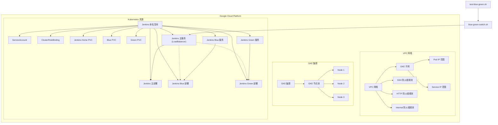

# tf-jenkins-on-gke

使用 Terraform 在 Google Kubernetes Engine (GKE) 上部署高可用 Jenkins 集群，并实现蓝绿发布功能。本方案支持零停机部署、自动扩缩容和灵活的流量管理。

## 项目概述

本项目提供了一个完整的解决方案，用于在 GKE 上部署 Jenkins 并实现蓝绿发布。主要特点包括：

- **高可用性**：Jenkins 主节点和工作节点均部署在 GKE 集群中，支持自动恢复
- **蓝绿部署**：实现零停机部署，支持快速回滚
- **基础设施即代码**：使用 Terraform 管理所有云资源
- **模块化设计**：清晰的模块划分，便于维护和扩展
- **安全加固**：默认启用网络策略、RBAC 和 TLS 加密

## 架构图



## 项目结构

```
tf-jenkins-on-gke/
├── main.tf                  # 主 Terraform 配置文件
├── variables.tf             # 变量定义文件
├── modules/                 # 模块目录
│   ├── network/              # 网络模块
│   │   ├── main.tf          # 网络配置
│   │   ├── variables.tf     # 网络模块变量
│   │   └── outputs.tf       # 网络模块输出
│   ├── gke/                 # GKE 集群模块
│   │   ├── main.tf          # GKE 集群配置
│   │   ├── variables.tf     # GKE 模块变量
│   │   └── outputs.tf       # GKE 模块输出
│   └── jenkins/             # Jenkins 模块
│       ├── main.tf          # Jenkins 基本配置
│       ├── variables.tf     # Jenkins 模块变量
│       ├── outputs.tf       # Jenkins 模块输出
│       └── blue-green-deployment.tf # 蓝绿部署配置
├── environments/            # 环境特定配置
│   ├── dev/                 # 开发环境
│   └── prod/                # 生产环境
└── scripts/                 # 脚本目录
    ├── blue-green-switch.sh # 蓝绿发布切换脚本
    └── test-blue-green.sh   # 蓝绿发布测试脚本
```

## 系统要求

### 前提条件

- [Terraform](https://www.terraform.io/downloads.html) >= 1.0.0
- [Google Cloud SDK](https://cloud.google.com/sdk/docs/install)
- [kubectl](https://kubernetes.io/docs/tasks/tools/install-kubectl/)
- [Helm](https://helm.sh/docs/intro/install/) >= 3.0.0
- 有效的 Google Cloud 项目和相应的 IAM 权限

### 资源需求

- GCP 项目配额：
  - 至少 8 个 vCPU
  - 至少 32GB 内存
  - 至少 200GB 持久存储

### 网络要求

- 出站互联网访问（用于下载容器镜像）
- 如果使用私有集群，需要配置 Cloud NAT 或代理服务器

- [Terraform](https://www.terraform.io/downloads.html) >= 0.14
- [Google Cloud SDK](https://cloud.google.com/sdk/docs/install)
- [kubectl](https://kubernetes.io/docs/tasks/tools/install-kubectl/)
- 有效的 Google Cloud 项目和相应的权限

## 配置指南

### 1. 基本配置

创建 `terraform.tfvars` 文件并配置必要的变量：

```hcl
# GCP 项目配置
project_id = "your-gcp-project-id"
region     = "asia-east1"
zone       = "asia-east1-a"

# 网络配置
network_name         = "jenkins-network"      # VPC 网络名称
subnet_name          = "jenkins-subnet"       # 子网名称
subnet_ip_cidr_range = "10.0.0.0/20"          # 子网 IP CIDR 范围
ip_range_pods_name   = "ip-range-pods"        # Pod IP 范围名称
ip_range_pods_cidr   = "10.16.0.0/16"         # Pod IP CIDR 范围
ip_range_services_name = "ip-range-services"  # 服务 IP 范围名称
ip_range_services_cidr = "10.20.0.0/16"       # 服务 IP CIDR 范围

# GKE 集群配置
cluster_name = "jenkins-cluster"
node_count   = 3
machine_type = "e2-standard-2"

# Jenkins 配置
jenkins_namespace = "jenkins"

# 监控配置
enable_monitoring = true
monitoring_namespace = "monitoring"

# 日志配置
enable_logging = true
log_retention_days = 30

# 备份配置
enable_backup = true
backup_schedule = "0 2 * * *"  # 每天凌晨2点执行备份

# 安全配置
enable_network_policy = true
enable_private_nodes = true
enable_workload_identity = true
```

### 2. 高级配置

#### 2.1 自定义 Jenkins 配置

可以自定义 Jenkins 的配置参数：

```hcl
jenkins_config = {
  admin_username = "admin"
  admin_password = "your-secure-password"
  java_opts      = "-Xmx2048m -Xms512m"
  # 更多配置...
}
```

#### 2.2 插件管理

可以指定要安装的 Jenkins 插件：

```hcl
jenkins_plugins = [
  "workflow-aggregator",
  "git",
  "kubernetes",
  "blueocean",
  "pipeline-utility-steps",
  "sonar"
]
```

#### 2.3 资源限制

可以为 Jenkins 主节点和工作节点设置资源限制：

```hcl
jenkins_resources = {
  master = {
    requests = {
      cpu    = "1000m"
      memory = "2048Mi"
    }
    limits = {
      cpu    = "2000m"
      memory = "4096Mi"
    }
  }
  agent = {
    requests = {
      cpu    = "500m"
      memory = "512Mi"
    }
    limits = {
      cpu    = "1000m"
      memory = "2048Mi"
    }
  }
}
```

1. 创建 `terraform.tfvars` 文件并配置必要的变量：

```hcl
# GCP 项目配置
project_id = "your-gcp-project-id"
region     = "asia-east1"
zone       = "asia-east1-a"

# 网络配置
network_name         = "jenkins-network"      # VPC 网络名称
subnet_name          = "jenkins-subnet"       # 子网名称
subnet_ip_cidr_range = "10.0.0.0/20"          # 子网 IP CIDR 范围
ip_range_pods_name   = "ip-range-pods"        # Pod IP 范围名称
ip_range_pods_cidr   = "10.16.0.0/16"         # Pod IP CIDR 范围
ip_range_services_name = "ip-range-services"  # 服务 IP 范围名称
ip_range_services_cidr = "10.20.0.0/16"       # 服务 IP CIDR 范围

# GKE 集群配置
cluster_name = "jenkins-cluster"
node_count   = 3
machine_type = "e2-standard-2"

# Jenkins 配置
jenkins_namespace = "jenkins"
```

## 部署指南

### 1. 初始化环境

```bash
# 设置 GCP 项目
gcloud config set project your-project-id

# 启用必要的 API
gcloud services enable container.googleapis.com \
    compute.googleapis.com \
    cloudresourcemanager.googleapis.com \
    iam.googleapis.com
```

### 2. 部署基础设施

```bash
# 初始化 Terraform
terraform init

# 查看执行计划
terraform plan -out=tfplan

# 应用配置
terraform apply tfplan
```

### 3. 访问 Jenkins

部署完成后，获取 Jenkins 访问地址：

```bash
# 获取 Jenkins 负载均衡器 IP
kubectl get svc jenkins -n jenkins -o jsonpath='{.status.loadBalancer.ingress[0].ip}'

# 获取初始管理员密码
kubectl exec -it $(kubectl get pods -n jenkins -l app=jenkins,env=blue -o jsonpath='{.items[0].metadata.name}') -n jenkins -- cat /var/jenkins_home/secrets/initialAdminPassword
```

## 蓝绿发布管理

### 1. 自动测试蓝绿发布

项目包含一个测试脚本，可以自动测试蓝绿发布流程：

```bash
# 确保脚本有执行权限
chmod +x scripts/test-blue-green.sh

# 运行测试脚本
./scripts/test-blue-green.sh jenkins
```

### 2. 手动切换环境

如果需要手动切换蓝绿环境：

```bash
# 切换到蓝色环境
./scripts/blue-green-switch.sh jenkins blue

# 切换到绿色环境
./scripts/blue-green-switch.sh jenkins green
```

### 3. 验证环境状态

```bash
# 查看当前活跃环境
kubectl get svc jenkins -n jenkins -o jsonpath='{.spec.selector.environment}'

# 查看 Pod 状态
kubectl get pods -n jenkins

# 查看服务状态
kubectl get svc -n jenkins
```

### 部署基础设施

1. 初始化 Terraform：

```bash
terraform init
```

2. 查看部署计划：

```bash
terraform plan
```

3. 应用部署：

```bash
terraform apply
```

4. 确认部署后，Terraform 将输出 Jenkins 的 URL 和 IP 地址。

### 蓝绿发布

项目包含了蓝绿发布的功能，可以通过以下步骤进行测试：

1. 确保脚本具有执行权限：

```bash
chmod +x scripts/blue-green-switch.sh scripts/test-blue-green.sh
```

2. 测试蓝绿发布功能：

```bash
./scripts/test-blue-green.sh jenkins
```

该脚本将执行以下操作：
- 检查 Jenkins 服务和蓝绿部署是否存在
- 确定当前服务指向的环境（蓝色或绿色）
- 切换到另一个环境
- 验证切换是否成功
- 测试服务是否可访问
- 切换回原始环境

### 手动切换蓝绿环境

如果需要手动切换蓝绿环境，可以使用以下命令：

```bash
./scripts/blue-green-switch.sh jenkins blue  # 切换到蓝色环境
```

或

```bash
./scripts/blue-green-switch.sh jenkins green  # 切换到绿色环境
```

## 监控与日志

### 1. 访问监控面板

如果启用了监控，可以通过以下方式访问 Prometheus 和 Grafana：

```bash
# 端口转发到本地
kubectl port-forward -n monitoring svc/prometheus-server 9090:80 &
kubectl port-forward -n monitoring svc/grafana 3000:80 &

# 访问地址
# Prometheus: http://localhost:9090
# Grafana: http://localhost:3000 (admin/prom-operator)
```

### 2. 查看日志

```bash
# 查看 Jenkins 日志
kubectl logs -f -n jenkins -l app=jenkins --tail=100

# 查看系统组件日志
kubectl logs -n kube-system -l k8s-app=kube-dns
```

## 备份与恢复

### 1. 配置自动备份

项目支持自动备份 Jenkins 数据到 Google Cloud Storage：

```hcl
# 在 terraform.tfvars 中启用备份
enable_backup = true
backup_bucket = "your-backup-bucket"
backup_schedule = "0 2 * * *"  # 每天凌晨2点执行备份
```

### 2. 手动备份

```bash
# 执行手动备份
kubectl create job --from=cronjob/jenkins-backup manual-backup-$(date +%s) -n jenkins
```

### 3. 从备份恢复

```bash
# 列出可用的备份
gsutil ls gs://your-backup-bucket/jenkins/

# 执行恢复
kubectl apply -f config/restore-job.yaml -n jenkins
```

## 维护与排错

### 1. 常见问题

#### Jenkins 无法启动

```bash
# 检查 Pod 状态
kubectl describe pod -n jenkins -l app=jenkins

# 检查事件
kubectl get events -n jenkins --sort-by='.metadata.creationTimestamp'
```

#### 无法访问 Jenkins

```bash
# 检查服务状态
kubectl get svc -n jenkins

# 检查入口控制器
kubectl get ingress -n jenkins

# 检查防火墙规则
gcloud compute firewall-rules list
```

### 2. 性能调优

#### 调整资源配额

```hcl
# 在 terraform.tfvars 中调整资源限制
jenkins_resources = {
  master = {
    limits = {
      cpu    = "4000m"
      memory = "8192Mi"
    }
  }
}
```

#### 优化 JVM 参数

```hcl
jenkins_java_opts = "-Xms2048m -Xmx4096m -XX:MaxMetaspaceSize=512m -XX:MaxRAMFraction=2 -XX:+UseContainerSupport -XX:+UseG1GC"
```

## 安全加固

### 1. 网络策略

默认启用网络策略，限制 Pod 间通信：

```yaml
# config/network-policy.yaml
apiVersion: networking.k8s.io/v1
kind: NetworkPolicy
metadata:
  name: jenkins-network-policy
  namespace: jenkins
spec:
  podSelector: {}
  policyTypes:
  - Ingress
  - Egress
  ingress:
  - from:
    - podSelector: {}
  egress:
  - to:
    - podSelector: {}
```

### 2. 密钥管理

使用 Kubernetes Secrets 或外部密钥管理系统存储敏感信息：

```bash
# 创建加密密钥
kubectl create secret generic jenkins-secrets \
  --from-literal=admin-password='your-secure-password' \
  --namespace=jenkins
```

## 扩展与定制

### 1. 添加自定义插件

在 `config/plugins.txt` 中添加需要的插件：

```
# 插件列表
git:4.11.0
kubernetes:1.30.0
blueocean:1.25.1
```

### 2. 自定义 Jenkins 配置

将自定义的 Jenkins 配置文件放在 `config/jenkins-config.yaml` 中。

## 清理资源

要删除所有创建的资源，请运行：

```bash
terraform destroy
```

## 最佳实践

### 1. 生产环境建议

- 使用专用节点池运行 Jenkins 主节点
- 为 Jenkins 工作负载配置 Pod 反亲和性
- 定期备份 Jenkins 配置和数据
- 监控关键指标并设置告警
- 定期更新 Jenkins 和插件到最新稳定版本

### 2. 安全建议

- 限制对 Jenkins 管理界面的访问
- 启用 RBAC 和网络策略
- 定期轮换凭证和密钥
- 审核插件权限

### 3. 性能优化

- 为大型团队配置多个 Jenkins 执行器
- 使用 Kubernetes 动态扩缩容工作节点
- 优化构建流水线以减少资源占用
- 定期清理旧的构建记录和工件

## 故障排除

### 1. 常见问题

#### 1.1 Pod 无法调度

```bash
# 检查节点资源
kubectl describe nodes

# 检查 Pod 事件
kubectl describe pod <pod-name> -n jenkins
```

#### 1.2 持久卷问题

```bash
# 检查 PVC 状态
kubectl get pvc -n jenkins

# 检查 PV 状态
kubectl get pv
```

### 2. 获取支持

如果遇到问题，请提供以下信息：

1. Kubernetes 版本：`kubectl version`
2. 部署日志：`kubectl logs -n jenkins -l app=jenkins --tail=100`
3. 事件日志：`kubectl get events -n jenkins --sort-by='.metadata.creationTimestamp'`

## 贡献指南

欢迎贡献代码和文档！提交 PR 前请确保：

1. 代码符合项目规范
2. 包含必要的测试
3. 更新相关文档
4. 提交信息清晰明确

## 许可证

本项目采用 [MIT 许可证](LICENSE)

## 致谢

- [Terraform](https://www.terraform.io/)
- [Google Cloud](https://cloud.google.com/)
- [Kubernetes](https://kubernetes.io/)
- [Jenkins](https://www.jenkins.io/)

## 注意事项

- 首次访问 Jenkins 时，需要获取初始管理员密码。可以通过以下命令获取：

```bash
kubectl exec -it $(kubectl get pods -n jenkins -l app=jenkins,env=blue -o jsonpath='{.items[0].metadata.name}') -n jenkins -- cat /var/jenkins_home/secrets/initialAdminPassword
```

- 蓝绿部署使用了两个独立的 Jenkins 实例，每个实例都有自己的持久卷。这意味着它们的配置和插件是独立的，需要单独配置。

- 在生产环境中，建议使用共享存储或配置管理工具来确保蓝绿环境的一致性。
