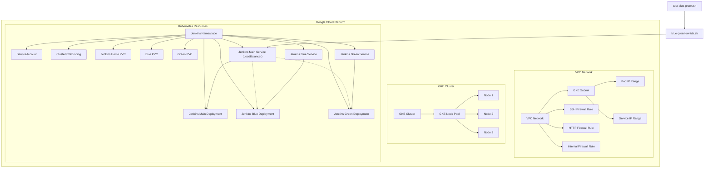

# tf-jenkins-on-gke

Deploy a highly available Jenkins cluster on Google Kubernetes Engine (GKE) using Terraform, featuring Blue-Green Deployment functionality. This solution supports zero-downtime deployments, auto-scaling, and flexible traffic management.

## Project Overview

This project provides a complete solution for deploying Jenkins on GKE with Blue-Green deployment capabilities. Key features include:

- **High Availability**: Jenkins master and agents are deployed in a GKE cluster with auto-recovery
- **Blue-Green Deployment**: Zero-downtime deployments with quick rollback capability
- **Infrastructure as Code**: All cloud resources managed with Terraform
- **Modular Design**: Clear module separation for easy maintenance and extension
- **Security Hardening**: Network policies, RBAC, and TLS encryption enabled by default

## Architecture Diagram



## Project Structure

```
tf-jenkins-on-gke/
├── main.tf                  # Main Terraform configuration file
├── variables.tf             # Variable definitions
├── modules/                 # Modules directory
│   ├── network/             # Network module
│   │   ├── main.tf          # Network configuration
│   │   ├── variables.tf     # Network module variables
│   │   └── outputs.tf       # Network module outputs
│   ├── gke/                 # GKE cluster module
│   │   ├── main.tf          # GKE cluster configuration
│   │   ├── variables.tf     # GKE module variables
│   │   └── outputs.tf       # GKE module outputs
│   └── jenkins/             # Jenkins module
│       ├── main.tf          # Jenkins basic configuration
│       ├── variables.tf     # Jenkins module variables
│       ├── outputs.tf       # Jenkins module outputs
│       └── blue-green-deployment.tf # Blue-Green deployment configuration
├── environments/            # Environment-specific configurations
│   ├── dev/                 # Development environment
│   └── prod/                # Production environment
└── scripts/                 # Scripts directory
    ├── blue-green-switch.sh # Blue-Green deployment switch script
    └── test-blue-green.sh   # Blue-Green deployment test script
```

## System Requirements

### Prerequisites

- [Terraform](https://www.terraform.io/downloads.html) >= 1.0.0
- [Google Cloud SDK](https://cloud.google.com/sdk/docs/install)
- [kubectl](https://kubernetes.io/docs/tasks/tools/install-kubectl/)
- [Helm](https://helm.sh/docs/intro/install/) >= 3.0.0
- Valid Google Cloud project with appropriate IAM permissions

### Resource Requirements

- GCP Project Quota:
  - Minimum 8 vCPUs
  - Minimum 32GB RAM
  - Minimum 200GB persistent storage

### Network Requirements

- Outbound internet access (for container image downloads)
- If using a private cluster, configure Cloud NAT or a proxy server

- [Terraform](https://www.terraform.io/downloads.html) >= 0.14
- [Google Cloud SDK](https://cloud.google.com/sdk/docs/install)
- [kubectl](https://kubernetes.io/docs/tasks/tools/install-kubectl/)
- Valid Google Cloud project with appropriate permissions

## Configuration Guide

### 1. Basic Configuration

Create a `terraform.tfvars` file with the following variables:

```hcl
# GCP Project Configuration
project_id = "your-gcp-project-id"
region     = "asia-east1"
zone       = "asia-east1-a"

# Network Configuration
network_name         = "jenkins-network"      # VPC Network name
subnet_name          = "jenkins-subnet"       # Subnet name
subnet_ip_cidr_range = "10.0.0.0/20"          # Subnet IP CIDR range
ip_range_pods_name   = "ip-range-pods"        # Pod IP range name
ip_range_pods_cidr   = "10.16.0.0/16"         # Pod IP CIDR range
ip_range_services_name = "ip-range-services"  # Service IP range name
ip_range_services_cidr = "10.20.0.0/16"       # Service IP CIDR range

# GKE Cluster Configuration
cluster_name = "jenkins-cluster"
node_count   = 3
machine_type = "e2-standard-2"

# Jenkins Configuration
jenkins_namespace = "jenkins"

# Monitoring Configuration
enable_monitoring = true
monitoring_namespace = "monitoring"

# Logging Configuration
enable_logging = true
log_retention_days = 30

# Backup Configuration
enable_backup = true
backup_schedule = "0 2 * * *"  # Daily backup at 2 AM

# Security Configuration
enable_network_policy = true
enable_private_nodes = true
enable_workload_identity = true
```

### 2. Advanced Configuration

#### 2.1 Custom Jenkins Configuration

Customize Jenkins configuration parameters:

```hcl
jenkins_config = {
  admin_username = "admin"
  admin_password = "your-secure-password"
  java_opts      = "-Xmx2048m -Xms512m"
  # Additional configurations...
}
```

#### 2.2 Plugin Management

Specify Jenkins plugins to install:

```hcl
jenkins_plugins = [
  "workflow-aggregator",
  "git",
  "kubernetes",
  "blueocean",
  "pipeline-utility-steps",
  "sonar"
]
```

#### 2.3 Resource Limits

Set resource limits for Jenkins master and agents:

```hcl
jenkins_resources = {
  master = {
    requests = {
      cpu    = "1000m"
      memory = "2048Mi"
    }
    limits = {
      cpu    = "2000m"
      memory = "4096Mi"
    }
  }
  agent = {
    requests = {
      cpu    = "500m"
      memory = "512Mi"
    }
    limits = {
      cpu    = "1000m"
      memory = "2048Mi"
    }
  }
}
```

1. Create a `terraform.tfvars` file and configure the necessary variables:

```hcl
# GCP Project Configuration
project_id = "your-gcp-project-id"
region     = "asia-east1"
zone       = "asia-east1-a"

# Network Configuration
network_name         = "jenkins-network"      # VPC Network name
subnet_name          = "jenkins-subnet"       # Subnet name
subnet_ip_cidr_range = "10.0.0.0/20"          # Subnet IP CIDR range
ip_range_pods_name   = "ip-range-pods"        # Pod IP range name
ip_range_pods_cidr   = "10.16.0.0/16"         # Pod IP CIDR range
ip_range_services_name = "ip-range-services"  # Service IP range name
ip_range_services_cidr = "10.20.0.0/16"       # Service IP CIDR range

# GKE Cluster Configuration
cluster_name = "jenkins-cluster"
node_count   = 3
machine_type = "e2-standard-2"

# Jenkins Configuration
jenkins_namespace = "jenkins"
```

## Deployment Guide

### 1. Environment Setup

```bash
# Set GCP project
gcloud config set project your-project-id

# Enable required APIs
gcloud services enable container.googleapis.com \
    compute.googleapis.com \
    cloudresourcemanager.googleapis.com \
    iam.googleapis.com
```

### 2. Deploy Infrastructure

```bash
# Initialize Terraform
terraform init

# Review execution plan
terraform plan -out=tfplan

# Apply configuration
terraform apply tfplan
```

### 3. Access Jenkins

After deployment, retrieve Jenkins access details:

```bash
# Get Jenkins load balancer IP
kubectl get svc jenkins -n jenkins -o jsonpath='{.status.loadBalancer.ingress[0].ip}'

# Get initial admin password
kubectl exec -it $(kubectl get pods -n jenkins -l app=jenkins,env=blue -o jsonpath='{.items[0].metadata.name}') -n jenkins -- cat /var/jenkins_home/secrets/initialAdminPassword
```

## Blue-Green Deployment Management

### 1. Test Blue-Green Deployment

A test script is included to validate the blue-green deployment process:

```bash
# Ensure scripts are executable
chmod +x scripts/test-blue-green.sh

# Run test script
./scripts/test-blue-green.sh jenkins
```

### 2. Manual Environment Switching

To manually switch between blue and green environments:

```bash
# Switch to blue environment
./scripts/blue-green-switch.sh jenkins blue

# Switch to green environment
./scripts/blue-green-switch.sh jenkins green
```

### 3. Verify Environment Status

```bash
# Check active environment
kubectl get svc jenkins -n jenkins -o jsonpath='{.spec.selector.environment}'

# Check pod status
kubectl get pods -n jenkins

# Check service status
kubectl get svc -n jenkins
```

### Deploy Infrastructure

1. Initialize Terraform:

```bash
terraform init
```

2. View the deployment plan:

```bash
terraform plan
```

3. Apply the deployment:

```bash
terraform apply
```

4. After confirming the deployment, Terraform will output the Jenkins URL and IP address.

### Blue-Green Deployment

The project includes Blue-Green deployment functionality, which can be tested using the following steps:

1. Ensure the scripts have execution permissions:

```bash
chmod +x scripts/blue-green-switch.sh scripts/test-blue-green.sh
```

2. Test the Blue-Green deployment functionality:

```bash
./scripts/test-blue-green.sh jenkins
```

This script will perform the following operations:
- Check if Jenkins services and Blue-Green deployments exist
- Determine which environment (blue or green) the current service points to
- Switch to the other environment
- Verify the switch was successful
- Test if the service is accessible
- Switch back to the original environment

### Manual Blue-Green Environment Switching

If you need to manually switch between Blue-Green environments, you can use the following command:

```bash
./scripts/blue-green-switch.sh jenkins blue  # Switch to blue environment
```

or

```bash
./scripts/blue-green-switch.sh jenkins green  # Switch to green environment
```

## Monitoring and Logging

### 1. Access Monitoring Dashboards

If monitoring is enabled, access Prometheus and Grafana:

```bash
# Port-forward to localhost
kubectl port-forward -n monitoring svc/prometheus-server 9090:80 &
kubectl port-forward -n monitoring svc/grafana 3000:80 &

# Access URLs
# Prometheus: http://localhost:9090
# Grafana: http://localhost:3000 (admin/prom-operator)
```

### 2. View Logs

```bash
# View Jenkins logs
kubectl logs -f -n jenkins -l app=jenkins --tail=100

# View system component logs
kubectl logs -n kube-system -l k8s-app=kube-dns
```

## Backup and Recovery

### 1. Configure Automatic Backups

Automatic backups to Google Cloud Storage can be configured:

```hcl
# In terraform.tfvars
enable_backup = true
backup_bucket = "your-backup-bucket"
backup_schedule = "0 2 * * *"  # Daily backup at 2 AM
```

### 2. Manual Backup

```bash
# Create manual backup
kubectl create job --from=cronjob/jenkins-backup manual-backup-$(date +%s) -n jenkins
```

### 3. Restore from Backup

```bash
# List available backups
gsutil ls gs://your-backup-bucket/jenkins/

# Execute restore
kubectl apply -f config/restore-job.yaml -n jenkins
```

## Maintenance and Troubleshooting

### 1. Common Issues

#### Jenkins Fails to Start

```bash
# Check pod status
kubectl describe pod -n jenkins -l app=jenkins

# Check events
kubectl get events -n jenkins --sort-by='.metadata.creationTimestamp'
```

#### Cannot Access Jenkins

```bash
# Check service status
kubectl get svc -n jenkins

# Check ingress controller
kubectl get ingress -n jenkins

# Check firewall rules
gcloud compute firewall-rules list
```

### 2. Performance Tuning

#### Adjust Resource Quotas

```hcl
# In terraform.tfvars
jenkins_resources = {
  master = {
    limits = {
      cpu    = "4000m"
      memory = "8192Mi"
    }
  }
}
```

#### Optimize JVM Parameters

```hcl
jenkins_java_opts = "-Xms2048m -Xmx4096m -XX:MaxMetaspaceSize=512m -XX:MaxRAMFraction=2 -XX:+UseContainerSupport -XX:+UseG1GC"
```

## Security Hardening

### 1. Network Policies

Network policies are enabled by default to restrict pod communication:

```yaml
# config/network-policy.yaml
apiVersion: networking.k8s.io/v1
kind: NetworkPolicy
metadata:
  name: jenkins-network-policy
  namespace: jenkins
spec:
  podSelector: {}
  policyTypes:
  - Ingress
  - Egress
  ingress:
  - from:
    - podSelector: {}
  egress:
  - to:
    - podSelector: {}
```

### 2. Secret Management

Use Kubernetes Secrets or external secret management systems for sensitive information:

```bash
# Create encrypted secret
kubectl create secret generic jenkins-secrets \
  --from-literal=admin-password='your-secure-password' \
  --namespace=jenkins
```

## Extensibility and Customization

### 1. Adding Custom Plugins

Add required plugins to `config/plugins.txt`:

```
# Plugin list
git:4.11.0
kubernetes:1.30.0
blueocean:1.25.1
```

### 2. Custom Jenkins Configuration

Place custom Jenkins configuration in `config/jenkins-config.yaml`.

## Cleanup

To delete all created resources, run:

```bash
terraform destroy
```

## Best Practices

### 1. Production Recommendations

- Use dedicated node pools for Jenkins masters
- Configure pod anti-affinity for Jenkins workloads
- Regularly back up Jenkins configuration and data
- Monitor key metrics and set up alerts
- Keep Jenkins and plugins updated to the latest stable versions

### 2. Security Recommendations

- Restrict access to the Jenkins admin interface
- Enable RBAC and network policies
- Rotate credentials and secrets regularly
- Audit plugin permissions

### 3. Performance Optimization

- Configure multiple executors for large teams
- Use Kubernetes dynamic scaling for agents
- Optimize build pipelines to reduce resource usage
- Regularly clean up old build records and artifacts

## Troubleshooting

### 1. Common Issues

#### 1.1 Pod Scheduling Failures

```bash
# Check node resources
kubectl describe nodes

# Check pod events
kubectl describe pod <pod-name> -n jenkins
```

#### 1.2 Persistent Volume Issues

```bash
# Check PVC status
kubectl get pvc -n jenkins

# Check PV status
kubectl get pv
```

### 2. Getting Support

When requesting support, please provide the following information:

1. Kubernetes version: `kubectl version`
2. Deployment logs: `kubectl logs -n jenkins -l app=jenkins --tail=100`
3. Event logs: `kubectl get events -n jenkins --sort-by='.metadata.creationTimestamp'`

## Contributing

Contributions to code and documentation are welcome! Before submitting a PR, please ensure:

1. Code follows project standards
2. Includes necessary tests
3. Documentation is updated
4. Commit messages are clear and descriptive

## License

This project is licensed under the [MIT License](LICENSE)

## Acknowledgments

- [Terraform](https://www.terraform.io/)
- [Google Cloud](https://cloud.google.com/)
- [Kubernetes](https://kubernetes.io/)
- [Jenkins](https://www.jenkins.io/)

## Notes

- When accessing Jenkins for the first time, you need to obtain the initial admin password. You can get it using the following command:

```bash
kubectl exec -it $(kubectl get pods -n jenkins -l app=jenkins,env=blue -o jsonpath='{.items[0].metadata.name}') -n jenkins -- cat /var/jenkins_home/secrets/initialAdminPassword
```

- The Blue-Green deployment uses two separate Jenkins instances, each with its own persistent volume. This means their configurations and plugins are independent and need to be configured separately.

- In a production environment, it is recommended to use shared storage or configuration management tools to ensure consistency between Blue-Green environments.
