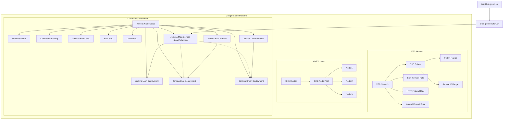

# tf-jenkins-on-gke

Deploy Jenkins on Google Kubernetes Engine (GKE) using Terraform, with Blue-Green Deployment functionality.

## Architecture Diagram



## Project Structure

```
tf-jenkins-on-gke/
├── main.tf                  # Main Terraform configuration file
├── variables.tf             # Variable definitions
├── modules/                 # Modules directory
│   ├── network/             # Network module
│   │   ├── main.tf          # Network configuration
│   │   ├── variables.tf     # Network module variables
│   │   └── outputs.tf       # Network module outputs
│   ├── gke/                 # GKE cluster module
│   │   ├── main.tf          # GKE cluster configuration
│   │   ├── variables.tf     # GKE module variables
│   │   └── outputs.tf       # GKE module outputs
│   └── jenkins/             # Jenkins module
│       ├── main.tf          # Jenkins basic configuration
│       ├── variables.tf     # Jenkins module variables
│       ├── outputs.tf       # Jenkins module outputs
│       └── blue-green-deployment.tf # Blue-Green deployment configuration
├── environments/            # Environment-specific configurations
│   ├── dev/                 # Development environment
│   └── prod/                # Production environment
└── scripts/                 # Scripts directory
    ├── blue-green-switch.sh # Blue-Green deployment switch script
    └── test-blue-green.sh   # Blue-Green deployment test script
```

## Prerequisites

- [Terraform](https://www.terraform.io/downloads.html) >= 0.14
- [Google Cloud SDK](https://cloud.google.com/sdk/docs/install)
- [kubectl](https://kubernetes.io/docs/tasks/tools/install-kubectl/)
- Valid Google Cloud project with appropriate permissions

## Configuration

1. Create a `terraform.tfvars` file and configure the necessary variables:

```hcl
# GCP Project Configuration
project_id = "your-gcp-project-id"
region     = "asia-east1"
zone       = "asia-east1-a"

# Network Configuration
network_name         = "jenkins-network"      # VPC Network name
subnet_name          = "jenkins-subnet"       # Subnet name
subnet_ip_cidr_range = "10.0.0.0/20"          # Subnet IP CIDR range
ip_range_pods_name   = "ip-range-pods"        # Pod IP range name
ip_range_pods_cidr   = "10.16.0.0/16"         # Pod IP CIDR range
ip_range_services_name = "ip-range-services"  # Service IP range name
ip_range_services_cidr = "10.20.0.0/16"       # Service IP CIDR range

# GKE Cluster Configuration
cluster_name = "jenkins-cluster"
node_count   = 3
machine_type = "e2-standard-2"

# Jenkins Configuration
jenkins_namespace = "jenkins"
```

## Usage

### Deploy Infrastructure

1. Initialize Terraform:

```bash
terraform init
```

2. View the deployment plan:

```bash
terraform plan
```

3. Apply the deployment:

```bash
terraform apply
```

4. After confirming the deployment, Terraform will output the Jenkins URL and IP address.

### Blue-Green Deployment

The project includes Blue-Green deployment functionality, which can be tested using the following steps:

1. Ensure the scripts have execution permissions:

```bash
chmod +x scripts/blue-green-switch.sh scripts/test-blue-green.sh
```

2. Test the Blue-Green deployment functionality:

```bash
./scripts/test-blue-green.sh jenkins
```

This script will perform the following operations:
- Check if Jenkins services and Blue-Green deployments exist
- Determine which environment (blue or green) the current service points to
- Switch to the other environment
- Verify the switch was successful
- Test if the service is accessible
- Switch back to the original environment

### Manual Blue-Green Environment Switching

If you need to manually switch between Blue-Green environments, you can use the following command:

```bash
./scripts/blue-green-switch.sh jenkins blue  # Switch to blue environment
```

or

```bash
./scripts/blue-green-switch.sh jenkins green  # Switch to green environment
```

## Cleanup

To delete all created resources, run:

```bash
terraform destroy
```

## Notes

- When accessing Jenkins for the first time, you need to obtain the initial admin password. You can get it using the following command:

```bash
kubectl exec -it $(kubectl get pods -n jenkins -l app=jenkins,env=blue -o jsonpath='{.items[0].metadata.name}') -n jenkins -- cat /var/jenkins_home/secrets/initialAdminPassword
```

- The Blue-Green deployment uses two separate Jenkins instances, each with its own persistent volume. This means their configurations and plugins are independent and need to be configured separately.

- In a production environment, it is recommended to use shared storage or configuration management tools to ensure consistency between Blue-Green environments.
